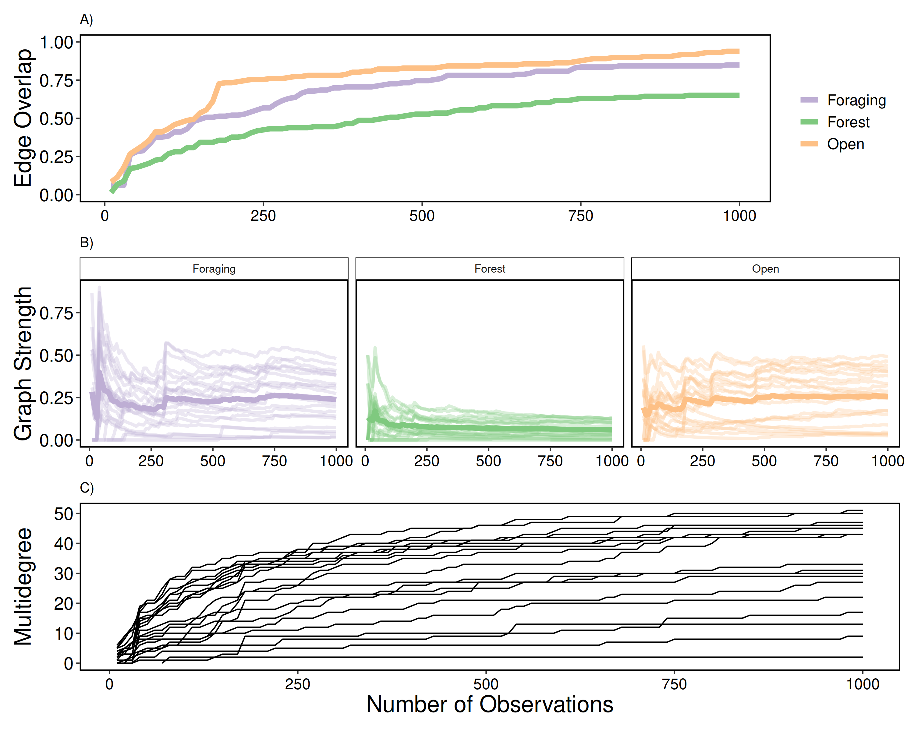

```{r setup, include=FALSE}
knitr::opts_chunk$set(
    echo = FALSE,
    # warning = FALSE,
    # message = FALSE,
    eval = TRUE,
    out.width = '\\linewidth'
)

source('../scripts/0-variables.R')
```

# Abstract
Scale remains a seminal concept in ecology. Spatial scale, for instance, has
become a central consideration in the way we understand landscape ecology and
animal space use. Meanwhile, social processes can also scale from fine-scale
interactions to co-occurrence to overlapping home ranges. Multilayer networks
promise the integration of monolayer animal social networks with the complexity
and importance of animal space use and movement in heterogeneous landscapes.
Despite the complex interplay between social networks and how animals use space,
there remains an important biological and methodological gap in our
understanding of an animal’s perception of scale, e.g., grain and extent. But
scale can affect multilayer network dynamics and how we build and interpret
them. Here, we discuss the role of scale in the context of multilayer networks
and provide a case study of caribou (*Rangifer tarandus*) to illustrate the role
of social,spatial, and temporal scale on multilayer processes. We also present
perspectives on future development and application of scale in multilayer
networks with respect to habitat selection and space use, individual fitness and
phenotypes, and movement ecology and collective movement.Effective integration
of social and spatial processes, including biologically meaningful scales,
within the context of animal social networks is an emerging area of research;
our contribution uniquely incorporates perspectives on how the social
environment and spatial processes are linked across scales in a multilayer
framework. Based on social network and behavioural ecology theory as well as our
case study, we demonstrate potential for interconnectedness among individual
animals, their social environment, and the landscapes they occupy.


# Introduction
Our inference regarding the ecological processes underlying ecological patterns
are directly linked to the scale at which they are observed [@Levin_1992;
@Allen_2015]. Animals are influenced across scales, through processes such as
species-specific as trophic interactions and resource availability
[@Legendre_1993; @Chave_2013] and global climate and productivity [@Field_2009].
Multiscale ecology has been integrated into species distribution modelling
[@Elith_2009], habitat selection [@Mayor_2007], and food webs [@Sugihara_1989].
Meanwhile, in the context of animal behaviour, certain behaviours are scale
dependent, for example, acoustic communication in birds occurs over variable
spatial scales [@Luther_2009]. We posit that animal behaviour and, more
specifically, the social environment that animals experience must also be
scale-dependent.


Sociality exists across both temporal and spatial scales (Whitehead 2008). For
example, grooming requires close spatial proximity between conspecifics and
occurs over brief time periods (e.g. Carter et al. 2015), whereas social
association represents shared space use by members of the same social group
(Figure 1, Franks et al. 2010). Further, for social interactions or associations
to occur individuals must share space, and thus have overlapping home ranges. In
the context of the social environment, home range overlap is a relatively coarse
scale of sociality across which individuals share space over coarser spatial and
temporal scales (e.g. Piza-Roca et al. 2018). Although the social environment
clearly scales spatially and temporally, it remains unclear whether coarser
scales of sociality, including social association and home range overlap, vary
predictably with social interaction (Castles et al. 2014; Farine 2015). Thus, we
define social scale as the type of social relationship observed that can be
explicitly defined and measured (Farine et al. 2015).


Animal social network analysis is a well-developed tool used to measure the
relationships of individuals and organization of social systems (Krause et al.
2009; Wey et al. 2008; Croft et al. 2008). Social network analysis provides
insight into the structure of social communities and social network properties,
which can influence population dynamics and evolutionary processes
(Pinter-Wollman et al. 2014; Kurvers et al. 2014). Despite the widespread use
and innovation of traditional social network analysis (Webber & Vander Wal
2019), it typically considers a single scale of sociality in a given network
(monolayer), drastically simplifying the potential complexity of animal social
systems (Finn et al. 2019). 


Unlike traditional monolayer social networks, multilayer networks explicitly
consider social systems across contexts, including scale-dependent contexts
(Pilosof et al. 2017). Multilayer networks are made up of multiple layers, each
representing different classes of individuals (e.g. male or female), types of
behaviours (e.g. grooming, travelling, or foraging), spatial areas (e.g. local
or regional), or temporal windows (e.g. daily or seasonal) (Kivela et al. 2014;
Porter 2018). Multilayer networks are relatively novel to studies of animal
behaviour (Finn et al. 2019; Silk et al. 2018), although they have been used to
describe multidimensional human social systems, complex transportation networks,
and neural networks (Silk et al. 2018). The role of scale within multilayer
social networks remains unexplored but provides a unique opportunity to develop
novel understanding of variation in the temporal or spatial scales associated
with social systems.


Our study is motivated by behavioural, landscape, and spatial ecology to build a
conceptual and analytical framework for scale-dependent multilayer networks and
we apply this framework to a case study of caribou (*Rangifer tarandus*) in
Newfoundland, Canada [@Peignier_2019]. We use this case study to address two
principal questions associated with scale-dependent multilayer networks. First,
to what degree does the social scale of relationships, spatial scale of
landscapes, and temporal scale of analysis influence our ability to interpret
complex social systems? Second, can variation in social, spatial, and temporal
improve predictions associated with biological differences in seasonal resource
availability and social association? We conclude with perspectives for further
development and application of scale in multilayer networks with respect to
landscape ecology (Schneider 2009)<!-- TODO-->, individual fitness and
phenotypes (Webber & Vander Wal 2018), and movement ecology and collective
movement (Jolles et al. 2019).


(ref:spacetime) Space-time diagram displaying variation the spatial and temporal extent required for different social processes across a range of taxa.

```{r, fig.cap='(ref:spacetime)'}
knitr::include_graphics('../graphics/figure1.png')
```


# Scale in multilayer networks: a case study

## Caribou socioecology
Here, we use caribou as a case study to develop scale-dependent multilayer
networks based on social (visual and auditory perception), spatial (habitat
type), and temporal (seasonal). Caribou are gregarious ungulates with
fission-fusion dynamics [@Lesmerises_2018] that display temporal
[@Peignier_2019] and spatial (Webber et al. unpublished data) variation in
social networks. In winter, caribou dig holes in the snow, termed craters, to
access forage (Bergerud 1974)<!-- TODO-->. As a result, caribou tend to occupy
and re-use craters once they are established and there is considerably less
access to forage than when the landscape is snow-free. Importantly, craters
exist on the landscape at multiple scales: the crater scale (a single crater),
the feeding area scale (multiple craters in close proximity), and the winter
range scale (all craters within an individual’s range) [@Mayor_2009]. The
distribution of forage for caribou is therefore seasonally heterogeneous, with
greater access in snow-free seasons compared to winter as well as spatially
heterogeneous in winter because the distribution of craters on the landscape
varies meaning that access to vegetation in winter is highly variable for
caribou. We therefore partitioned data into two discrete seasons:  summer (3
August - 20 September) and winter (1 January – 17 February) based on caribou
socioecology [@Peignier_2019].

## Caribou location data
We used GPS location data collected from Fogo Island caribou in 2017 and 2018.
Adult female caribou were immobilized and fitted with global positioning system
(GPS) collars (Lotek Wireless Inc., Newmarket, ON, Canada, GPS4400M collars,
1,250 g) as described by Schaefer and Mahoney (2013). Collars were programmed to
collect location fixes every 2 hours. Prior to analyses, we subset GPS fixes
into a discrete removed all erroneous and outlier GPS fixes following Bjørneraas
et al. (2010)<!-- TODO-->. We did not collar all female caribou in the herd;
however, we assumed that our sample of collared animals was random.

## Landscape data and habitat classification
Landcover data were provided by the Newfoundland and Labrador Wildlife Division.
Available landcover classification included nine habitat types at <!-- TODO:
double check --> 10m resolution. We reclassified the landcover types into three
categories: foraging habitat, open habitat, and forest habitat. Foraging habitat
<!-- or just lichen like figs?--> consisted of lichen habitat, open habitat
consisted of wetland, rocky barrens, and anthropogenic habitat types, while
forest habitat consisted of coniferous forest, conifer scrub, broadleaf forest,
and mixed-wood forest habitat types. Water habitat was excluded from all
subsequent analyses.
<!-- using the raster package for R? -->

## Caribou multilayer social networks

### Network types and construction (defining layers for the multilayer network)
<!-- should use something like "using syntax from Kivela 2014..." or 
Following [@Kivela_2014]:
other info to maybe include: the multilayer network was not node-aligned since
not all individuals were on all layers
the temporal aspect is ordinal coupling and landcover aspect is categorical coupling

Individuals were subset to ensure they had data collected in both seasons
-->

We generated a multilayer social network consisting 16 individual nodes and two
aspects (season and landcover). Two season elementary-layers (winter and summer)
and three landcover elementary-layers (open, forest and lichen) combined for a
total of six layers. Layers were the social association network generated in
each season and landcover combination. Proximity-based social network layers
were generated using the R package `spatsoc` [@Robitaille_2019] in `r version$version.string` [@R_Core_Team_2019].

Within each layer, we assumed individuals were associating if simultaneous GPS
fixes (i.e., recorded within 5 minutes of each other) were within a given
spatial distance of one another. Typically for ungulates and other gregarious
mammals, the ‘chain rule’ is applied for group assignment. For GPS data, the
chain rule is applied if discrete spatiotemporal GPS fixes buffered by a given
distance formed a contiguous buffer for two or more individuals, even if some
individuals within the buffer were not within the given distance of one another
[@Robitaille_2019]. Group assignment based on the chain rule has previously been
applied to caribou at a distance of 50m [@Peignier_2019; @Lesmerises_2018]. In
all networks, nodes represented individuals, intralayer edges represented
associations between individuals in a given habitat type and season, and
interlayer edges represented connections between the same individuals across
contexts.

We weighted edges of social networks by the strength of association between
caribou using the simple ratio index (SRI, Cairns and Schwager 1987): <!-- TODO-->

$$ SRI = \frac{x}{x + y_{AB} + y_{A} + y_{B}} $$

where x is the number of fixes where individuals A and B were within a given
distance of each other, $y_{A}$ is the number of fixes from individual A when
individual B did not have a simultaneous fix, $y_{B}$ is the number of fixes
from individual B when individual A did not have a simultaneous fix, and
$y_{AB}$ is the number of simultaneous fixes from individuals A and B that were
separated by more than the given distance [@Farine_2015]. Social groups were
designated if two or more individuals occurred within a given distance of one
another at any given time point.

### Network metrics
We used a series of metrics to characterize the multilayer networks focusing on the relevance of individual layers, 
similarity of layers and the role of individuals. We calculated multidegree, the sum of degree centrality across layers, and neighbourhood, the sum of unique neighbours to each individual [@Berlingerio_2012; @Kivela_2014]. Comparing the multidegree and number of unique neighbours, we measured the connective redundancy, the proportion of neighbours repeated in multiple layers, and the layer relevance, the proportion of neighbours present compared to the neighbourhood for each individual. To measure the role of individuals, we calculated the graph strength for each individual for each layer specific season and landcover context. 


e focused on four aspects
of the network: “interlayer correlation and reducibility”
(i.e., correlation between layers and similarities regarding
the information contained in each one; “node versatility”
(i.e., role of each node in the connectedness and information
flow of the network); “community structure” (i.e., whether
there are subsets of nodes more tightly connected among
each other than with the rest); and “motif analysis” (i.e.,
non-random patterns of interconnection between triads).


Node based


Calculated for each layer 
and for multilayer total


For each multilayer network, we calculated a series of metrics on individual layers and  four metrics. These included:
multidegree, graph strength, redundancy/relevance, and  layer similarity. 

<!-- GOING
TO NEED MORE HERE (SEE SMITH-AGUILAR ET AL 2019 PAPER FOR REFERENCE ON
EXPLAINING THESE).
-->

<!-- 
ALR: Reference for extending degree centrality to multilayer, neighbors,
connective redundancy and relevance: Berlingerio 2011 "Foundations of
multidimensional..."
-->

* Multidegree
* Degree centrality
* Multidegree
* Degree deviation: standard deviation of degree across layers
* Neighbors/neighborhood (number of unique actors directly connected to each focal): Neighbors = degree within a network layer. But across a multilayer network with multiple layers, some neighbors are repeated. 
* Graph strength
* Connective redundancy: 1 - (neighborhood / degree) When connective redundancy is 0, all edges on all layers are necessary to preserve the social ties
* Relevance: neighborhood of specific layer  / neighbourhood of full ml net. This is the proportion of neighbors present on the layer of focus. Comparing across, it tells you which layers are most important for each individual. 
* layer similarity

* Multidegree: sum of degree across layers. High multidegree = connected to many
individuals across layers. Low multidegree = not connected to many individuals
across layers.

* Degree deviation: deviation of degree across layers. High degree deviation =
large difference between degree for an individual across layers. Low degree
deviation = individuals are similarly connected across layers.

* Graph strength: weighted version of degree. High graph strength = highly
connected. Not summed in this case across layers.

* Neighbours: number of unique individuals adjacent to each actor. Considered in
a single layer, this is equal to the degree.

* Neighbourhood: number of unique individuals across all layers. High
neighbourhood = a high number of unique individuals connected to an actor. 

* Relevance: layer centric metric, corresponding to the number of neighbours on a
layer divided by the total neighbourhood for each actor. High relevance means
that the layer is highly relevant to the individuals connections. A low
relevance means this layer does not contribute many neighbours to an individuals
overall neighbourhood.

* Connective redundancy: the total multilayer neighbourhood divided by the
multidegree. High connective redundancy indicates a multilayer network that has
many repeated edges across layers between an actor and its neighbours. Low
connective redundancy indicates that each layer is important for preserving all
social ties.

* Layer similarity: how similar each layer is (Brodka 2018). Pearson's
correlation coefficient of degree vectors for each layer, comparing each
landcover across seasons.


## Varying scale in multilayer networks

### Social scale

We altered social scale based on visual (short distance) and auditory (long
distance) sensory modalities of caribou <!--(REF?)-->. Specifically, we modified
the spatial distance threshold required for group assignment (see above) and
re-assigned groups at incremental distance between 5-500m. For example, at the
finest social scale, only individuals within 5m of one another were considered
in the same group, whereas at the coarsest social scale, individuals within 500m
of one another were considered in the same group.

### Spatial scale

To assess the influence of spatial scale on multilayer networks, we aggregated
our landcover classification map at varying scales relevant to caribou ecology.
We aggregated the 10m landcover raster using the R package `grainchanger`
[@Graham_2019] at five scales: 100m, 250m, 500m, and 1000m. Aggregation occurred
using a modal moving window method using a circular window corresponding to the
above scales [@Graham_2019a]. 10m and 100m represents fine-scale decision making
for caribou during foraging <!--(REF)-->, while re-sampling at 500m and 1000m
represents the scale at which caribou tend to select and avoid habitat
(Bastille-Rousseau et al. 2017).


### Temporal scale

We altered the temporal scale of multilayer networks by varying the length and
position of the time window used to define seasons. The length of the time
window varied from 40-100 days using a fixed start day for winter (1 January)
and summer (3 August). The position of the time window was shifted by 1-48 days,
using a fixed time window length of 48 days. These new time windows were
iteratively used to partition data into two discrete seasons (winter, summer)
and generate multilayer networks.

Studies of social network analysis vary in the number and frequency of
observations as well as the data collection technique used to generate networks
(Davis et al. 2018; Webber and Vander Wal 2019). In addition to altering the
temporal scale by adjusting the time window, we investigated the influence of the number of observations on
resulting multilayer networks. We randomly selected 500 timesteps and
iteratively included 25 additional observations, regenerating the multilayer
network and calculating associations of individuals. Subsequent iterations
included the previous set of observations to mimic observational data.

# Scale in multilayer networks in practice: case study results and discussion

## Each metric's interpretation
* Multidegree: sum of degree across layers. High multidegree = connected to many
individuals across layers. Low multidegree = not connected to many individuals
across layers.

* Degree deviation: deviation of degree across layers. High degree deviation =
large difference between degree for an individual across layers. Low degree
deviation = individuals are similarly connected across layers.

* Graph strength: weighted version of degree. High graph strength = highly
connected. Not summed in this case across layers.

* Neighbours: number of unique individuals adjacent to each actor. Considered in
a single layer, this is equal to the degree.

* Neighbourhood: number of unique individuals across all layers. High
neighbourhood = a high number of unique individuals connected to an actor. 

* Relevance: layer centric metric, corresponding to the number of neighbours on a
layer divided by the total neighbourhood for each actor. High relevance means
that the layer is highly relevant to the individuals connections. A low
relevance means this layer does not contribute many neighbours to an individuals
overall neighbourhood.

* Connective redundancy: the total multilayer neighbourhood divided by the
multidegree. High connective redundancy indicates a multilayer network that has
many repeated edges across layers between an actor and its neighbours. Low
connective redundancy indicates that each layer is important for preserving all
social ties.

* Layer similarity: how similar each layer is (Brodka 2018). Pearson's
correlation coefficient of degree vectors for each layer, comparing each
landcover across seasons.


## Figure captions and brief interpretations


(ref:lcres) Varying scale in landcover resolution. For each landcover resolution (10m, 100m, 250m, 500m and 1000m), multilayer networks were constructed for each landcover class (forest, lichen and open) across two seasons (summer and winter), and four network metrics were calculated. A) Similarity of landcover network layers between seasons (e.g.: open summer compared to open winter) showed different responses to changing landcover scale with an increase in similarity for forest layers at 250m and decrease in similarity for open layers at 250m. Note that lichen layer similarity is not shown because individuals did not interact in lichen habitats greater greater than 10m landcover resolution. B) Mean connective redundancy across individuals showed a decreasing trend with increasing landcover resolution. C) Mean layer relevance showed sparse connectivity in summer compared to winter networks and a decrease in winter lichen layer relevance at higher landcover resolutions. D) Mean graph strength of individuals was weaker during the summer compared to the winter months.  


* decreasing availability of patchy lichen = no edges in these layers, though some small proportion of relocations still exist in those layers
* decreasing connective redundancy because through resolution because lichen decreased in connectivity and landcovers became more homogeneous (?)
* decreasing winter lichen relevance because the degree + number of edges decreased


```{r, fig.cap='(ref:lcres)'}
knitr::include_graphics('../graphics/figure-lcres.png')
```


(ref:socres) Varying scale in social threshold. For each social threshold (5m, 50m, 100m, 150m, 200m, 250m, 300m, 350m, 400m, 450m, 500m), multilayer networks were constructed for each landcover class (forest, lichen and open) across two seasons (summer and winter) and four network metrics calculated. A) Similarity of landcover network layers between seasons (e.g.: open summer compared to open winter) showed different responses to changing landcover scale with an overall increase in similarity for open layers and decrease in similarity for lichen layers.**[JWT: what about forest. This made me realize that the legend isn't wide enougth to really tell the difference between lty, forest and open look the same in the legend]** B) Mean connective redundancy across individuals increased rapidly between 5m and 50m reaching a plateau  of about 0.65 **[JWT: Does this have units??]** at approximately a 50m **??** social threshold before decreasing between 400m and 500m. C) Mean layer relevance was relatively stable across social thresholds for each season and landcover layer. D) Mean graph strength across individuals showed an increase for winter network layers at 50m through 500m while summer network layers had consistently weak connections. **[JWT: I'm not sure sparse is the best word, they don't have strong connections, which is related to the number of associations, but it also has to do with the SRI. I would talk about it more about strong/weak connections. Networks can be sparse (few connections), but still have high strength if the ties have higher values]**


* increasing layer relevance as more individuals are connected with increasing buffer size
* decrease in connective redundancy due an increase in summer forest degree at the last (500m) social threshold
* increasing graph strength consistent with increasing strength in winter


```{r, fig.cap='(ref:socres)'}
knitr::include_graphics('../graphics/figure-spatialthreshold.png')
```


(ref:winlen) Varying scale in time window length. For each time window length (40 to 100 days in length increasing by 5 days in sequence), multilayer networks were constructed for each landcover class (forest, lichen and open) across two seasons (summer and winter) and four network metrics calculated. A) Similarity of landcover network layers between seasons (e.g.: open summer compared to open winter) showed increasing similarity consistent across landcover layers with increasing window length. B) Mean connective redundancy across individuals varied dramatically depending on the lenght of the time window **[JWT: previously this was describing fig. 3. I don't know if what I wrote best encapsulates what connnective redundancy does here. Length of time window seems to make connective redundancy highly variable as it changes.]**. C) Mean layer relevance benerally increased during the summer months but was relatively stable across time window lengths for each landcover layer. D) Mean graph strength across individuals was relatively stable over increasing time window lengths, though there was more variation in strength between landcover types as window length increased. **[see if you agree with my changes. B-D were based off fig. 3 and not relevant to this figure]**


* increasing window length = increasingly similar layers and increasingly redundant edges. more individuals have the opportunity to interact
* increasing window length also leads to increasing similarity between seasons because seasons are less well defined/include more shoulder seasons
* decreasing graph strength at the upper end of window length in winter showing again inclusion of more shoulder season
* layers are more similarly relevant at high window length


```{r, fig.cap='(ref:winlen)'}
knitr::include_graphics('../graphics/figure-winlength.png')
```


<!-- RO first sentence... -->

(ref:nobs) Varying scale in number of observations. For each iteration, a number of observations (10-485 observations in steps of 25) were selected from the complete data set to construct multilayer networks with layers defined by each landcover class (forest, lichen and open) across two seasons (summer and winter) and four network metrics calculated. A) Similarity of landcover network layers between seasons (e.g.: open summer compared to open winter) showed a stabilizing layer similarity at 200 observations for forest and 300 observations for lichen and open. *There were observations of individuals in lichen and open areas at lower numbers of observations during the winter, so layer similarity could not be calculated at these values.* **Brief explanation of why two landcover don't have values at lower nobs??**. B) Mean connective redundancy across individuals increased with increasing number of observations, which begins to plateau around 100 observations. C) Mean layer relevance across individuals increased for winter layers and slightly increased for summer layers. D) Mean graph strength across individuals varied for winter layers becoming relatively stable at 200 observations and remained weak throughout for summer layers.


* common, though at different points - more observations until stabilizing
* we dont see the stabilizing/full plateau for connective redundancy but appears to be coming.. 
* still some variability, especially for graph strength because individuals are differently connected but broad strokes - they stabilize with more observations


```{r, fig.cap='(ref:nobs)'}

```


(ref:winpos) Varying scale in time window position. For each time window position (shifting the start date of the time window used to define seasons 1 to 48 days from the original), multilayer networks were constructed for each landcover class (forest, lichen and ope) across two seasons (summer and winter) and four network metrics calculated. A) Similarity of landcover network layers between seasons (e.g.: open summer compared to open winter) showed fluctuations in layer similarity across landcover types with shifted time windows. **[JWT: previously describing window length, not position. Check that you're ok with my changes]** B) Mean connective redundancy across individuals increased between window position 12 through 48 due to increased connectivity in the summer network layers. C) Mean layer relevance slightly decreased for winter layers and increased for summer layers, showing decreasing connectivity in shifted winter time windows and greater connectivity in summer layers at later window positions. D) Mean graph strength across individuals increased in summer network layers at window position 25 and increased between window position 20 and 40 for winter network layers.


* increasing network connectivity in summer when the window position is moved - these seasons are more similar than the original window position
* same theme shown in the connective redundancy
* quite variable layer similarity, not sure what to pull out of that one
* increased graph strength for winter down the middle, with generally increasing summer layers - again where the season is including more shoulder season potentially

```{r, fig.cap='(ref:winpos)'}
knitr::include_graphics('../graphics/figure-winpos.png')
```


##
Results and interpretation of temporal scale

Results and interpretation of spatial scale

Results and interpretation of social scale


# Perspectives  to advance multilayer networks 
## Habitat selection and space use 

* Mayor et al. 2009 paper 
* MRSF Laforge paper 
* van Beest et al. 2014 scale paper 
* 1st/2nd/3rd order selection
* Habitat–performance relationships: finding the right metric at a given spatial scale Jean-Michel Gaillard1,*, Mark Hebblewhite2, Anne Loison3, Mark Fuller4, Roger Powell5, Mathieu Basille1,6 and Bram Van Moorter1
* Multi-scale habitat selection modeling: a review and outlook

## Individual fitness and phenotypes

Social network positions are frequently used to represent the social environment
that an individual experiences or their social phenotype. Social phenotypes are
increasingly linked to important fitness for individuals of various species,
including primates (e.g. Brent, Ruiz-Lambides, & Platt, 2017; Thompson, 2019),
dolphins (e.g. Stanton & Mann, 2012; Stanton, Gibson, & Mann, 2011), and birds
(e.g. McDonald, 2007; Royle, Pike, Heeb, Richner, & Kolliker, 2012). Both
temporal, seasons and stages of life, and social scales, types of interactions,
have emerged as important for understanding fitness consequences in the context
of social network positions (Almeling, Hammerschmidt, Sennhenn-Reulen, Freund, &
Fischer, 2016; Berger, Lemaître, Allainé, Gaillard, & Cohas, 2015; Brent,
Ruiz-Lambides, & Platt, 2017; Holekamp, Smith, Strelioff, Van Horn, & Watts,
2012). Multilayer networks provide a way to bridge these different scales so
that we can examine social phenotypes in more holistic ways rather than looking
at each scale separately as has traditionally been done.


For instance, social scale is major consideration for social network analysis,
especially in the context of different types of relationships, such as grooming
and association, that are typically examined separately while answering a single
question (Carter, Lee, & Marshall, 2015; Castles et al., 2014; Farine, 2015).
Furthermore, it is a common trope that individuals must be associating to
interact, and many studies therefore assume that proximity is proxy for
interacting (Farine, 2015). For instance, baboons need to be in proximity in
order to groom each other. However, animals have certain interactions that do
not require proximity such as long-distance vocalization and olfactory signals
(Carter et al., 2015). With the advancement of biologging technology, we have
the ability to record social interactions that do not require proximity,
particularly long-distance communication networks with devices like microphone
arrays (Snijders & Naguib, 2017). These varying social scales can have different
fitness repercussions for individuals. Rhesus macaques (*Macaca mulatta*) had
higher survivorship when they had fewer but stronger, more stable social
associates and grooming partners rather than simply more associates (Ellis,
Snyder-Mackler, Ruiz-Lambides, Platt, & Brent, 2019). This finding highlights
that different qualities of social scales have lasting consequences.


Temporal scale is also important for understanding the repercussions of social
phenotypes. For instance, social phenotypes can change over ontogeny in ways
that can affect fitness (Berger et al., 2015; Brent et al., 2017). Thus, it is
critical to carefully consider the temporal scale that is meaningful for the
proposed hypotheses. Further complicating the issue of selecting suitable time
scales across ontogeny, individuals progress through development at different
rates (Tarka, Guenther, Niemelä, Nakagawa, & Noble, 2018). This variation can
make defining appropriate temporal scales for testing the fitness implications
of an individual’s social phenotype over different stages of ontogeny even more
difficult when they vary by individual. However, considering fine temporal
scales provide insight across developmental stages that may otherwise be missed
(Turner, Bills, & Holekamp, 2018).


Multilayer networks provide unique opportunities and challenges, linking these
various scales, for understanding the social phenotypes and environments of
individuals and their fitness outcomes. The multilayer network framework enables
researchers to examine these different social scales simultaneously rather than
individually, which is what has been done under most circumstances, but is not
very realistic. Metrics from multilayer networks provide an opportunity to
simplify statistical models. Interactions that happen side-by-side, proximity
associations, and long-distance interactions can be encapsulated in a single
multilayer network, and a single metric can be used to describe the various
social scales of an individual’s network position. This multilevel network
metric could be used to assess the relationship between an individual’s social
phenotype and fitness. It would also be a meaningful simplification of many
network metrics that could help simplify statistical analyses and deal with the
frequent correlations between social network metrics in different types of
networks (Castles et al., 2014). Furthermore, multilayer networks provide a
framework to test hypotheses linking social phenotypes and fitness across
temporal scales. Because of the non-independent nature of social interactions
and associations, especially over time, it is hard to test hypotheses about
social dynamics with a suitable null control (Farine, 2017; Proskurnikov &
Tempo, 2017). Using the framework of multilayer networks, making layers of
different temporal periods provides a way to make appropriate null models to
test questions about the dynamics of an individual’s social network position
over multiple aggregated time periods.


On the other hand, picking the proper temporal scale is important but a
challenge because all layers in the multilayer network should reflect the same
time period, and the period should be long enough for each layer to have enough
data for robust networks (Farine, 2017). These considerations may be limiting
factors when answering questions that require timeframes that are relevant to
different individuals, for instance. In both mono- and multilayer networks, the
effect of scale on the relationship between an individual’s social network
position and fitness need to be considered based on the hypotheses being tested
and logistical constraints.


## Movement ecology and collective movement

Animal movement undoubtedly affects an individual's social environment
(Strandburg-Peshkin et al. 2015). Movement is a dynamic process that is related
to the resources an individual consumes within their home range and the space
that they use (Van Moorter et al. 2016). Collective movement can reduce
group-level predation via detection-dilution trade-offs and improve information
transfer about the quality or location of resources to other group members
(Jolles et al. 2019). Social processes, movement decisions, and space use are
inextricably linked and multilayer networks represent a potential analytical
framework for linking these processes (e.g. Mourier et al. 2019).


Although multilayer animal social networks are relatively novel (Silk et al.
2018), movement behaviour within multilayer networks has already been considered
in a couple studies. In vulturine gunieafowl (*Acryllium vulturinum*), GPS
movement data were used to generate *monolayer* association networks within a
multilayer network (Papageorgiou et al. 2019). In addition, *spatial networks*
are physical locations (nodes) which are connected in a network when individuals
move between said locations (edges). For example, spatial networks were applied
to monitor movement of sharks (*Carcharhinus amblyrhynchos* and *Carcharhinus
melanopterus*) between fixed location autonomous arrays. In this example, nodes
represent locations within the array, *intralayer edges* represent individual
movement frequency, and *interlayer edges* represent contact probability among
individuals at a given node (Mourier et al. 2019). While both studies integrate
movement in some capacity, neither generate networks based on continuous
measures of dyadic or collective movement (Long et al. 2014).


In contrast to spatial networks, where nodes represent spatial locations that
are fixed in space, movement networks can represent continuous and simultaneous
movement trajectories of multiple animals. Continuous collection of animal
relocation data using GPS technology can be used to measure how groups of
animals make collective movement decisions in the context of their local
environment (Strandburg-Peshkin et al. 2015, 2017) and across scales. A
collective movement layer could constitute similarity in movement for dyads
(Long et al. 2014) or groups (Bode et al. 2011). This movement layer could be
made at a fine (i.e. minute-to-minute: Cleasby et al. 2019) or coarse scale
(global migration: Flack et al. 2018). Another potential application would be to
generate social networks during times when animals are engaged in different
behaviours, including traveling, interacting, or foraging (e.g. Muller et al.
2018; Finn et al. 2019) and construct a multilayer network based on
behaviour-specific monolayer networks (e.g. Smith-Aguilar et al. 2019).
Importantly, the key to incorporating movement in multilayer networks across
scales is the technological advancements available to overcome previous
limitations (see Hughey et al. 2018).


Given the existing framework for constructing multilayer networks from
behavioural layers (e.g. Smith-Aguilar et al. 2019), movement layers could be
integrated with interaction or association layers. Integrating movement layers
with habitat-specific social association layers could further shed light on the
role of movement as a driver of the social and spatial environments an
individual experiences (Webber and Vander Wal 2018). In our case study, we
generated multilayer networks based on habitat-specific monolayers. Coordinated
movement of dyads, or groups, could vary based on habitat, and the approach we
outline could be used to explore mechanisms linking the social and spatial
environments. For example, social processes may be an emergent property of the
landscape because animals aggregate at resources, such as waterholes
(Chamaillé-Jammes et al. 2008). Movement to, from, or within habitat patches  or
territories can also contribute to the formation of the social environment
(Spiegel et al. 2016). For example, in sleepy lizards (*Tiliqua rugosa*) males
interacted primarily at home range edges, presumably driving territorial
behaviour (Spiegel et al. 2018). Incorporating movement ecology within a
multilayer network framework is a logical next step for a burgeoning field. In
particular, when association networks are habitat-specific, we suggest the
integration of movement and space use in multilayer networks provides novel
insights into the effects of habitat configuration on the formation of the
social environment (He et al. 2019).


# Conclusions

something something blah blah.

Silk et al. (2018) presented some key multilayer questions in animal behaviour
research. While these questions represent an important starting point for
multilayer networks, we present an additional set of questions relevant to the
promise and problem of scale in mutlilayer networks:

1. How do social phenotypes across scales differently influence fitness? Are
some temporal or social scales better predictors for different fitness metrics?

1. Why do individuals associate more strongly with certain conspecifics in some
habitats? What, if any, is the role of movement in the context of habitat
networks?

1. How, and why, does the spatial scale of perception influence, e.g. auditory,
visual, or chemotaxis, influence the  social environment across scales? What is
the role of memory, and by extension social and spatial cognition, as animals
navigate their environment and make decisions about where to move next?


# Acknowledgements

<!-- add jack -->

We thank all members of the Wildlife Evolutionary Ecology Lab, including K.
Kingdon, S. Boyle,  C. Prokopenko, I. Richmond, J. Hogg, and L. Newediuk for
their comments on previous versions of this manuscript as well as D. C. Schneider
for inspiration and helpful discussions about scale. Funding for this study was
provided by a Vanier Canada Graduate Scholarship to QMRW and a NSERC Discovery
Grant to EVW.

# References