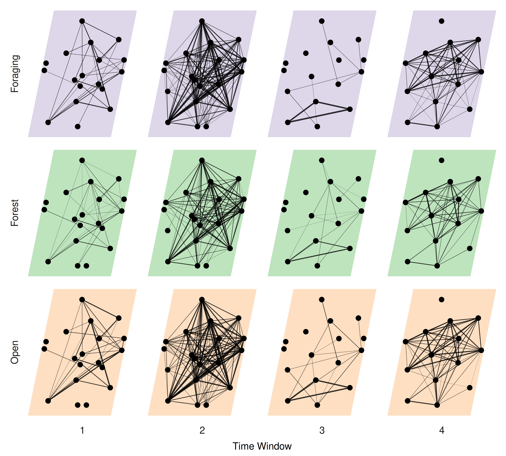

\newpage

```{r setup, include=FALSE}
knitr::opts_chunk$set(
    echo = FALSE,
    # warning = FALSE,
    # message = FALSE,
    eval = TRUE,
    out.width = '\\linewidth'
)

source('../scripts/00-variables.R')

library(data.table)
DT <- readRDS('../data/derived-data/01-sub-fogo-caribou.Rds')
nobs <- readRDS('../data/derived-data/05-number-of-observations.Rds')
timedefs <- fread('../data/supp-data/timecut-defs.csv')
```

\newpage

# Abstract
Scale remains a foundational concept in ecology. Spatial scale, for instance,
has become a central consideration in the way we understand landscape ecology
and animal space use. Meanwhile, social processes can also scale from fine-scale
interactions to co-occurrence to overlapping home ranges and vary within and 
across seasons. Multilayer networks promise the integration of monolayer
animal social networks with the complexity and importance of animal space use
and movement in heterogeneous landscapes. Despite the complex interplay between
social networks and animal space use, there remains an important biological
and methodological gap in our understanding of an animal’s perception of scale.
Here we discuss the role of scale in the context of multilayer networks and
provide a social ungulate case study to illustrate the role of social, spatial,
and temporal scale on multilayer processes. <!--We also present perspectives on
future development and applications of scale in multilayer networks with respect
to: phenotypes and individual fitness, movement ecology and collective movement,
and habitat selection and space use.--> Effective integration of social and spatial
processes, including biologically meaningful scales, within the context of
animal social networks is an emerging area of research. Here, we
incorporate perspectives on how the social environment and spatial processes
are linked across scales in a multilayer context.

## Keywords
Social network analysis, Landscape ecology, Movement ecology, Space use 

\newpage

# Introduction
Our inference regarding the processes underlying ecological patterns
are directly linked to the scale at which they are observed [@Levin_1992;
@Allen_2015]. Animals are influenced across scales, through ecological processes such as
species-specific trophic interactions, resource availability
[@Legendre_1993; @Chave_2013], and global climate and productivity [@Field_2009].
<!-- JWT: I'm not sure exactly what that sentence was trying to say so my edits may not work -->
Multiscale ecology has been integrated into species distribution modelling
[@Elith_2009], habitat selection [@Mayor_2007], and food webs [@Sugihara_1989],
among other processes. Meanwhile, in the context of animal behaviour, certain behaviours
are scale-dependent; for example, acoustic communication in birds varies with
spatial scales [@Luther_2009]. We posit that it is important to consider that
animal behaviour within the social environment will be scale-dependent. 
<!-- QW: I think this last sentence needs to be a bit stronger. Why is it important? -->

Sociality exists across both temporal and spatial scales (Whitehead 2008). For
example, grooming requires close spatial proximity between conspecifics and
occurs over brief time periods [e.g. @Carter_2015], whereas social association
represents shared space use by members of the same social group [Figure
\@ref(fig:spacetime), @Franks_2009]. Further, for social interactions or
associations to occur individuals must share space, and thus have overlapping
home ranges [@Vander_Wal_2013]. In the context of the social environment, home
range overlap is an example of how animals share space over coarser spatial and
temporal scales (e.g. Piza-Roca et al. 2018). Although the social environment
clearly scales spatially and temporally, it remains unclear whether coarser
scales of sociality, including social association and home range overlap, vary
predictably with social interaction [@Castles_2014;
@Farine_2015a]. We therefore define social scale as the type of social relationship
observed that can be explicitly defined and measured [@Farine_2015a] and suggest the 
potential for adaptive variance in social relationships is also scale-dependent. 
<!--QW: also need to fix up this last sentence- I added the 'adaptive variance part 
under the expectation that there is some scale at which variance is greatest, and presumably
it is this scale that has the greatest effect on fitness or other traits-->

Animal social network analysis is a well-developed tool used to measure the
relationships of individuals and organization of social systems [@Krause_2009;
@Wey_2008; @Croft_2011]. Social network analysis provides insight into the
structure of social communities and social network properties, which can
influence population dynamics and evolutionary processes [@Pinter_Wollman_2013;
@Kurvers_2014]. Despite the widespread use and innovation of traditional social
network analysis [@Webber_2019], it typically considers a single scale of
sociality in a given network (monolayer), drastically simplifying the
complexity of animal social systems [@Finn_2019].


Unlike traditional monolayer social networks, multilayer networks explicitly
consider social systems across scale-dependent contexts
[@Pilosof_2017]. Multilayer networks are made up of multiple layers, each
representing (i) different classes of individuals, e.g. male or female, (ii)
types of behaviours, e.g. grooming, travelling, or foraging, (iii) spatial
areas, e.g. local or regional, (iv) or temporal windows, e.g. daily or seasonal
[@Kivela_2014; @Porter_2018]. Multilayer networks are relatively novel to
studies of animal behaviour [@Silk_2018; @Finn_2019], although they have been
used to describe multidimensional human social systems, complex transportation
networks, and neural networks [@Silk_2018]. The role of scale within multilayer
social networks remains unexplored but provides a unique opportunity to develop
novel understanding of variation in the social, spatial, or temporal scales associated
with social systems.


Our examinations are motivated by behavioural, landscape, and spatial ecology to
build a conceptual and analytical framework for scale-dependent multilayer
networks, and we apply this framework to a case study of caribou (*Rangifer
tarandus*) in Newfoundland, Canada [@Peignier_2019]. We use this case study to
address two principal questions associated with scale-dependent multilayer
networks. First, to what degree does the social scale of relationships, spatial
scale of landscapes, and temporal scale of analysis influence our ability to
interpret complex social systems? Second, can variation in the social, spatial,
and temporal scale improve predictions associated with biological differences in
seasonal resource availability and social association? We conclude with
perspectives for further development and application of scale in multilayer
networks with respect to phenotypes and individual fitness,
movement ecology and collective movement, and habitat selection
and space use.
<!-- JWT: This part may have to change depending on how we do the disc -->

(ref:spacetime) Space-time diagram representing variation the relative spatial and temporal extent required for different types of social and communication processes for four species, including spotted hyaena, passerine birds, sleepy lizards, and elephants. Spatial and temporal extent for social interactions, e.g. mating, grooming, or aggression, are similar for most species because physical contact between two individuals is required for many social interactions. The logical extension is that spatial and temporal extent for social interaction is hierarchically nested within the spatial and temporal extent for social association because individuals must share space to interact. By contrast, different species have potential for greater spatial and temporal extents, for example, temporal extent for vocal communication is similar for most species because most vocal calls only persist in the environment for seconds, but spatial extent for vocal communication is highly variable with elephant calls extending the great distance and passerine calls extending the shortest distance.


# Methods

## Caribou socioecology
Caribou are gregarious
ungulates with fission-fusion dynamics [@Lesmerises_2018] that display temporal
and spatial variation in social networks [@Peignier_2019]. In winter, caribou
dig holes in the snow, termed craters, to access forage [@Bergerud_1974].
Cratering is presumed to be a costly behaviour and as a result, caribou tend to
occupy and re-use craters once they are established. <!-- and there is
considerably less access to forage than when the landscape is snow-free.-->
Importantly, craters exist on the landscape at multiple scales: the crater scale
(a single crater), the feeding area scale (multiple craters in close proximity),
and the winter range scale (all craters within an individual’s range)
[@Mayor_2009]. Access to forage is seasonally heterogeneous depending on snow
cover and, in winter, variable distribution of craters on the landscape.

## Caribou location data
We used GPS location data collected from Fogo Island caribou between `r DT[, format(min(datetime), '%F')]` and `r DT[, format(max(datetime), '%F')]`. Adult female caribou were immobilized and fitted with global positioning
system (GPS) collars (Lotek Wireless Inc., Newmarket, ON, Canada, GPS4400M
collars, 1,250 g) as described by [@Schaefer_2013]. Collars were programmed to
collect location fixes every 2 hours. Prior to analyses, we subset GPS fixes
to remove all erroneous and outlier GPS fixes following
[@Bjorneraas_2010]. We did not collar all caribou in the herd; however, the
proportion of marked adult females was ~10% of all adult females and ~5% of all
individuals in the herd. We assumed these individuals were randomly distributed
throughout the population.

## Landscape data and habitat classification
Land cover data were provided by the Newfoundland and Labrador Wildlife Division
[@Integrated_2013]<!--TODO: check ref-->. Available land cover classification
included nine habitat types at 30 m resolution. We reclassified the land cover
types into three categories using the R package `raster` [@Hijmans_2019]:
foraging, open, and forest habitats. Foraging habitat consisted of lichen, open
habitat consisted of wetland, rocky barrens, and anthropogenic, while forest
habitat consisted of coniferous forest, conifer scrub, broad leaf forest, and
mixed-wood forest. Water habitat was excluded from all subsequent analyses.


## Caribou multilayer social networks

### Network layer construction
<!--We generated a multilayer social network consisting `r DT[, uniqueN(get(idcol))]`
individual nodes and two aspects (season and land cover). Two season
elementary-layers (summer and winter) and three land cover elementary-layers
(forage, forest, and open) combined for a total of six layers. Single layers were
composed of individuals linked by social associations, for each season and land cover combination.-->

We generated proximity-based social networks using the R package `spatsoc`
[@Robitaille_2019] in `r version$version.string` [@R_Core_Team_2019]. We assumed
individuals were associating if simultaneous GPS fixes were within the spatial
distance threshold of one another. Typically for ungulates and other gregarious
mammals, the ‘chain rule’ is used for group assignment [@Croft_2008]. For GPS
data, the chain rule is applied by assigning a group identifier to the union of
buffered GPS fixes at each time step. As such, individuals in a group are within
the spatial distance threshold of at least one other though not necessarily all
other individuals [@Robitaille_2019]. Group assignment based on the chain rule
has previously been applied to caribou using a temporal threshold of 5 minutes
and a spatial distance threshold of 50 m [@Peignier_2019; @Lesmerises_2018]. In
all networks, individual caribou were represented as nodes and associations between
individuals in a given network layer were represented as intralayer
edges.


We weighted edges of social networks by the strength of association between
caribou using the simple ratio index [SRI, @Cairns_1987]:

$$ SRI = \frac{x}{x + y_{AB} + y_{A} + y_{B}} $$

where x is the number of fixes where individuals A and B were in the same group,
$y_{A}$ is the number of fixes from individual A when individual B did not have
a simultaneous fix, $y_{B}$ is the number of fixes from individual B when
individual A did not have a simultaneous fix, and $y_{AB}$ is the number of
simultaneous fixes from individuals A and B that were separated by more than the
spatial distance threshold [@Farine_2015].


### Network metrics 
We used a series of metrics to characterize the multilayer networks, focusing on
the role of individuals within and across layers, and the similarity of
different layers. To measure the role of individuals within layers, we
calculated degree centrality and graph strength. Degree centrality is the number
of direct connections an individual has to other individuals in a network layer.
Graph strength is the degree weighted by the strength of association, in this
case SRI, in each layer. Extending degree centrality to multiple layers, we calculated multidegree,
the sum of degree centrality of individuals across layers  [@Berlingerio_2012;
@Kivela_2014]. Finally, we measured the similarity of layers by calculating edge
overlap. Edge overlap is defined as the proportion of edges present in each
network layer out of all observed edges  [@Battiston_2014]. Network metrics were
calculated using the R packages `igraph` [@Csardi_2006], `asnipe`
[@Farine_2019], `spatsoc` [@Robitaille_2019] and `data.table` [@Dowle_2019].


## Varying scale in multilayer networks

### Social scale

We generated multilayer networks across a series of spatial distance thresholds 
that relate to behavioural interactions that could occur within those distances
<!-- JWT: or something like that needs to be in the first sentence to relate the spatial distance to social scale upfront -->
for group assignment. Spatial distance thresholds (5, 25, 50, 75, 100, 250 and
500 m) represented a range of visual (short distance) to auditory (long
distance) sensory modalities of caribou. Multilayer networks consisted of the
social association between `r DT[, uniqueN(get(idcol))]` individuals across
three habitat layers (open, forest and forage) for the entire study period. At
the finest scale, individuals within 5 m of one another were considered in the
same group, whereas at the coarsest scale, individuals within 500 m of one
another were considered in the same group. We calculated graph strength and
multidegree for each habitat layer and spatial distance threshold, and edge
<!-- JWT: can we call spatial distance social distance? -->
overlap across the entire series of networks to determine proportion of total
edges observed in each combination of habitat layer and spatial distance
threshold.


### Spatial scale
To assess the influence of spatial scale, we aggregated the land cover raster
using the R package `grainchanger` [@Graham_2019] across a series of scales (100
- 1000 m by steps of 100 m). The land cover raster was aggregated using a modal
moving window method using a circular window corresponding to the above scales
[@Graham_2019a]. We assume 30 m and 100 m represents fine-scale decision making
for caribou during foraging, while re-sampling at 500 m , 750 m and 1000 m
represents the scale at which caribou tend to select and avoid habitat
(Bastille-Rousseau et al. 2017). For each spatial scale, we generated a
multilayer network consisting of the social associations between 
`r DT[, uniqueN(get(idcol))]` individuals across three habitat layers (open, forest and
forage) for the entire study period. Social associations of individuals were
defined by spatiotemporal overlap within 5 minutes and 50 m. We calculated graph
strength and multidegree for each habitat layer and spatial scale, and edge
overlap across the entire series of networks to determine proportion of total
edges observed in each combination of habitat layer and spatial scale.
<!-- JWT: Your graphs present things in the order of Forage, Forest, Open, but in the text you do open, forest, forage. They need to be consistent -->


### Temporal scale
#### Time windows 
We used a temporal multilayer network to assess the seasonality of caribou
sociality. Multilayer networks consisted of the social associations between 
`r DT[, uniqueN(get(idcol))]` individuals across 20 ordinal sample periods of 35-36 <!--QW: why 35-36 and not just 35 or 36?-->
days taken from the entire study period. Social associations were defined by
spatiotemporal overlap of individuals within 5 minutes and 50 m. In each time
window, we calculated individual graph strength and multidegree, and across the
series of networks, we calculated edge overlap to determine proportion of total
edges observed in each time window.


#### Number of observations
Studies of social network analysis vary in the number and frequency of
observations as well as the data collection technique used to generate networks
[@Davis_2018; @Webber_2019]. For example, GPS data is commonly collected at a
fixed rate, e.g. every $x$ minutes or hours, continuously throughout the study
period. Fix rate is a reflection of number of observations an individual would
have been observed and recorded in traditional ethological studies. To
investigate the influence of number of observations, we generated multilayer
networks of social association between `r DT[, uniqueN(get(idcol))]` individuals
across three habitat layers (open, forest and forage) using $N$ randomly
selected observations. We first generated a maximum of 1000 timesteps and
iteratively used $N$ of these ($N$ = 10 - 1000 observations by steps of 10), to
ensure previously included timesteps, and resulting associations, were
accumulated with subsequent observations to mimic collection of observational
data. Within each multilayer network with $N$ observations, we calculated
individual graph strength and multidegree. We calculated edge overlap across the
entire series of networks to determine proportion of total edges as number of
observations increased.


# Results
Individuals in multilayer networks became more connected as the spatial distance
<!-- JWT: I really think calling it spatial distance is misleading given we want to represent social scale. Even if we stick with calling it spatial distance (I see you call it social distance in the graph), we need to lead in calling it social scale so the reader knows that's what we're referencing. -->
threshold increased. Mean graph strength differed across habitat layers with
similar and higher graph strength in open and forage layers, and lower strength
in forest layers (Figure \@ref(fig:socres)). Individual graph strength increased
sharply between 5 m and 100 m in all three habitat classes followed by a plateau in
the rate of increase after 100 m (<!--TODO: figure XX-->). 
These results suggest the optimal social scale at
which groups should be assigned is between ~20 - 100 m based on
the rate at which network metrics <!--QW: which metrics?--> stabilized. For ungulates, groups are often
assigned based on 50 m threshold (Lingle 2003; Lesmeries et al. 2018; Peignier
et al. 2019), suggesting that given similar quantities of data, ~50 m is likely
an appropriate social scale for generating social networks in caribou and
similar species. <!--QW: I'm not sure about this statement. Should it be more about 
how GPS data allows (e.g. from this study and Peignier et al; Lesmerises et al.) us to confirm 
the use of 50m buffer that has long been used for studies in the field (e.g. Lingle 2003 and 
any Clutton-Brock red deer paper that uses group size data)-->


Increasing land cover resolution resulted in decreased availability of foraging habitat 
<!--QW: I think we need to call this foraging habitat, when possible... forage to me 
refers to the thing an animal is eating-->,
a rare and patchy habitat, and corresponding low connectivity of individuals in
these habitats at higher resolution (Figure \@ref(fig:lcres)). Graph strength
and edge overlap were relatively consistent across land cover resolutions for
forest and open layers (Figure \@ref(fig:lcres) D, E). Edge overlap decreased
sharply between 30 m and 600 m in forage layers, afterwards remaining stable to
1000 m (Figure \@ref(fig:lcres) D). Graph strength was more variable within
foraging habitat layers across land cover resolutions than open and forest habitat layers (Figure
\@ref(fig:lcres) D). <!-- JWT: the order things are discussed here is a little confusing, you discuss strength, edge overlap, then strenght again. I think this should be reordered so it's easier to follow. -->
The proportion of relocations in forest and open habitats
increased with increasing spatial resolution, while decreasing in foraging habitat
(Supplementary 1 Figure 1).  Overall, these results indicate the importance of
matching land cover resolution to scale of selection as well as ensuring the
land cover product used has a resolution fine enough to detect landscape
features and habitats relevant to study species, such as important patchy and
rare habitats.
<!--QW: what makes it ordinal again? Is it ordinal OR continuous? -->
The ordinal multilayer network generated indicated within-year time windows of
increased caribou sociality. <!--QW: I'm not sure what you are trying to say in this first sentence. Is it that there are distinct within-year time windows where social network metrics increased? -->
Edge overlap was higher in time windows 1, 6-11 and
15-20 than in time windows 2-5 and 12-15  (Figure \@ref(fig:temp) A). <!--QW: I'm not sure about using the window number - it doesn't really mean anyhting. Can you use actual dates?--> Time
windows of higher edge overlap, between approximately October and May, had
correspondingly higher graph strength compared to time windows of lower edge
overlap, between approximately May and October (Figure \@ref(fig:temp) C). Graph
strength peaked across the time series in periods 9 and 10. These results
suggest that ordinal multilayer networks can effectively capture discrete time
windows of aggregation and dissaggregation related to resource availability, and
highlight the importance of carefully selecting the temporal scale of analysis.

As one might expect, when the number of observations used to generate multilayer networks increased,
individuals became more connected and variance in metrics decreased. <!--QW: I think throughout you want to say "variance decreased" instead of "stabilized" -->
Graph strength across individuals in all three habitat layers was highly
variable at low number of observations and stabilized after ~100 observations
(Figure \@ref(fig:nobs) A). Edge overlap increased across all three habitat
layers with increasing number of observations (Figure \@ref(fig:nobs) B).
Similarly, multidegree for all individuals increased quickly between 10 and 100
observations, and continued to increase until 1000 observations (Figure
\@ref(fig:nobs) C). Given the observed trend of these multilayer metrics
stabilizing after a certain number of observations are included, the results
suggest this sensitivity method could be useful for determining the number of
observations necessary for sufficiently describing social dynamics across
contexts.


<!-- Figure: metrics by social scale -->
(ref:socres) Varying scale in social distance threshold. For each social distance threshold (100 - 1000 m by steps of 100 m), multilayer networks were constructed of caribou social associations (*R. tarandus*, n = `r DT[, uniqueN(get(idcol))]` females) on Fogo Island, Newfoundland between `r DT[, format(min(datetime), '%F')]` and `r DT[, format(max(datetime), '%F')]` across three habitat classes (forage, forest, and open). Graph strength (mean of individuals in bold) showed a sharp increase between 5 m and 100 m for all habitat classes. After 100 m, graph strength continued to increase at a slower rate. Open and forage layers showed higher variation in graph strength between individuals while the forest layer had less variation and lower mean graph strength.


<!-- Figure: metrics by land cover resolution -->
(ref:lcres) Varying spatial scale of land cover raster. For each land cover resolution (5, 25, 50, 75, 100, 250 and 500 m), multilayer networks were constructed of caribou social associations (*R. tarandus*, n = `r DT[, uniqueN(get(idcol))]` females) on Fogo Island, Newfoundland between `r DT[, format(min(datetime), '%F')]` and `r DT[, format(max(datetime), '%F')]` across three habitat classes (forage, forest, and open). A, B, C) Three land cover rasters: the original resolution (30 m) and two aggregated rasters (500 m and 1000 m). D) Edge overlap of habitat layers across spatial resolutions. Open and forest layers show consistent edge overlap with increasing spatial resolution while forage shows a sharp decline in edge overlap between 30 m and 600 m. Above 600 m, the forage layers are stable. E) Graph strength (mean of individuals in bold) within habitat layers across spatial resolution. Forage layers showed high variation in graph strength with many individuals dropping to 0 after 500 m and others increasing with spatial resolution. Open layers and forest layers were relatively stable across spatial resolutions, with higher mean graph strength in open compared to forest.


<!-- Figure: metrics by number of observations -->
(ref:nobs) Varying scale in number of observations. Multilayer networks were generated using a  sample number of observations (10 - 1000 observations by steps of 10) of caribou social associations (*R. tarandus*, n = `r DT[, uniqueN(get(idcol))]` females) on Fogo Island, Newfoundland between `r DT[, format(min(datetime), '%F')]` and `r DT[, format(max(datetime), '%F')]` across three habitat classes (forage, forest, and open). A) Graph strength was highly variable at low number of observations (less than 100) for all habitat layers and relatively stable after 200 observations. B) Edge overlap increased for all habitat layers with increasing number of observations. Open and forage layers had higher edge overlap than forest layers. C) Multidegree increased for all individuals with increasing number of observations. Individuals showed high variability (`r nobs[nobs == max(nobs), paste(range(multideg), collapse = ' - ')]`) at the maximal number of observations (1000).


<!-- Figure: Time window -->
(ref:temp) Varying temporal scale in multilayer networks. Multilayer networks were generated of caribou social associations (*R. tarandus*, n = `r DT[, uniqueN(get(idcol))]` females) on Fogo Island, Newfoundland within ordinal time windows (20 ordinal sample periods of 35-36 days) between `r DT[, format(min(datetime), '%F')]` and `r DT[, format(max(datetime), '%F')]`. A) Edge overlap across time windows showed two periods of low overlap (time windows 2-5 and 12-15), and three periods of high overlap (time windows 1, 6-11, 15-20). B) Ordinal network layers showing unweighted edges between individuals within time windows. Like edge overlap, individuals were more connected in time windows 1, 6-11, and 15-20, compared to 2-5 and 12-15. C) Graph strength within time windows showing individuals as thin grey lines and mean across individuals as thick grey lines. Graph strength peaked in time window 9, with noticeable higher strength than the following year.

<!-- JWT: edge overlap, graph strength, and multidegree are presented in different orders in the graphs. They should be presented in the same order each time even if the combination of what you show changes. -->

# Discussion
<!-- 1)
First, to what degree does the social scale of relationships, spatial
scale of landscapes, and temporal scale of analysis influence our ability to
interpret complex social systems? 
-->

<!-- 2)
Second, can variation in the social, spatial,
and temporal scale improve predictions associated with biological differences in
seasonal resource availability and social association? 

+
We conclude with
perspectives for further development and application of scale in multilayer
networks with respect to phenotypes and individual fitness,
movement ecology and collective movement, and habitat selection
and space use.
-->

Our results highlight the influence of social, spatial and temporal scale on
multilayer networks. For social scale, we found individuals became more
connected with increasing spatial distance threshold. Increasing land cover
resolution lead to a decrease in availability of patchy and rare habitats and, 
<!--QW: not sure I'd mention 'rare' since there are only 3 habitat types. 
Could you just say 'less common' or even just 'patchy'?-->
correspondingly, lower connectivity of individuals in these habitats. Temporal
windows highlighted clear periods of increased sociality among individuals.
Finally, increasing number of observations lead to a general stabilizing in network
metrics. As such, scale is inherently tied to the generation  of multilayer
networks and metrics evaluating them, as well as the individual layers that make
them up.
<!--QW: I will pre-empt Eric and say I think this paragraph could maybe not mention the results at all. 
You could focus on just talking about the importance of scale for behavioural and spatial ecology.
Why is it important and what are the more broadly applicable ideas that lead us to this paper? 
Maybe keep this little summary paragraph for now - I think likely we could integrate what I describe 
above with what you already have-->

Monolayer network approaches have been increasingly used to link social network
position with individual fitness, including in primates [@Brent_2017;
@Thompson_2019], dolphins [@Stanton_2012; @Stanton_2011], and birds
[@McDonald_2007; @Royle_2012]. Social scale has emerged as an important variable
for understanding fitness consequences in the context of social network
positions <!-- TODO JWT check --> [@Almeling_2016; @Berger_2015; @Brent_2017;
@Holekamp_2011]. Defining the social scale to generate networks is an
essential consideration for social network analysis <!-- with direct impacts on
outcomes blah-->[@Castles_2014; @Carter_2015; @Farine_2015a]. Proximity-based
social networks generated using GPS location data require using a social scale,
specifically a spatial distance threshold, to define social associations. We
found increasing individual graph strength across three habitat types with
increasing spatial distance threshold (Figure \@ref(fig:socres)). In addition,
habitat layers differed in their response to spatial distance threshold, with
open and forage with a larger increase in graph strength and greater variation
across individuals. These results emphasize that multilayer network metrics are
directly influenced by social scale, in this case the spatial distance
threshold.

Social structure and habitat selection are intimately related: individuals must
share space to interact and the distribution of resources influences group
dynamics and home range size [@Webber_2018]. Social structure is influenced by
resource availability and seasonality [@Peignier_2019], configuration [@He_2019]
and fragmentation [@Banks_2007]. Habitat selection, the disproportionate use of
available resources or landscape features by animals [@Manly_1993; @Boyce_1999],
is a scale-dependent process [@Mayor_2009]. Johnson (1980) identified four orders of habitat selection: (1)
the geographical range of a species, (2) the home range of an individual, the
(3) habitat patches within the home range and (4) specific resources within a
habitat patch. Kie et al. [-@Kie_2002] found that, independently, third order of
selection was insufficient for capturing landscape attributes selected for by
mule deer (*Odocoileus hemionus*), at a scale larger than their home range size.
Moving past this hierarchical perspective, Mayor (2007) emphasized the
importance of considering a broad continuum of scales to reveal scale-dependent
selection and avoid the bias of predefined scales assumed to be associated with
certain behaviours. 

The emergent relationship between habitat and sociality has been explored by the
distribution and phenology of resources and use of social information. For
example, cougar (*Puma concolor*) home ranges overlapped more in regions with
high hunting opportunity, a proxy for resource richness [@Elbroch_2015]. Caribou
(*Rangifer tarandus*) social network graph strength differed between seasons, where 
graph strength was stronger in winter and contrastingly low in summer when
resource availability are more homogeneous [@Peignier_2019]. Bison (*Bison
bison*) showed stronger habitat selection in larger groups and avoidance of
predation risk was a main factor contributing to their habitat selection
[@Fortin_2009]. These examples, comparing sociality and habitat selection across
temporal or spatial contexts, are implicitly multilayer analyses.

Multilayer networks represent a novel framework for explicitly testing the
influence of habitat selection on sociality across scales. Animal social systems
can be parsed by spatial contexts, for example as defined by habitat types as in
Figure \@ref(fig:lcres). Given that habitat data are available across a wide
range of spatial scales, we evaluated the influence of habitat spatial
resolution on multilayer network metrics. The results indicate varied influence
of increasing spatial resolution depending on the habitat layer. As spatial
resolution increased, edge overlap decreased in forage while remaining stable in
open and forest habitats (Figure \@ref(fig:socres) D). Forage <!--Lichen? I think we need to call this lichen and not forage --> is a rare (<!--TODO--> XX % of the landscape) and
patchy habitat on Fogo Island, as is indicated by a decrease in the proportion
of relocations in this habitat type with increasing spatial resolution (Supplementary 1
Figure 1). Similar to increasing spatial distance threshold, the influence
of increasing spatial resolution on graph strength was notably different between
habitat layers. Forest layers showed little change in graph strength with
increasing spatial resolution and variation between individuals. Lichen and open
layers had greater individual variation in graph strength, while lichen was the
only layer to show large responses in graph strength to increasing spatial
resolution (Figure \@ref(fig:socres) E). As such, multilayer network measures
related to habitat are explicitly dependent on spatial scale. Edge overlap can
indicate if some associations between individuals are dependent on the
habitat-context [@Battiston_2014]. If the spatial resolution of the habitat data
are insufficient to capture rare habitats, context-specific relationships
between individuals may not be captured by multilayer networks.

Social processes, movement decisions, and space use are inextricably linked and
multilayer networks represent a potential analytical framework for linking these
processes [@Mourier_2019]. Movement as a collective group can reduce per capita
predation risk via detection-dilution trade-offs and improve information
transfer about the quality or location of resources to other group members
[@Jolles_2019]. Given the existing framework for constructing multilayer networks from
behavioural layers [e.g. @Smith_Aguilar_2019], monolayer networks that explicitly
quantify movement parameters could be integrated. For example, edges could
represent measures of dyadic or collective movement based on dynamic interaction
metrics [@Long_2014]. Integrating movement layers with habitat-specific social
association layers could further illuminate the role of movement as a driver
of the social and spatial environments an individual experiences [@Webber_2018].
We generated multilayer networks based on habitat-specific layers of 
social association. Coordinated movement of dyads, or groups, could vary based on
habitat, and the approach we outline could be used to explore mechanisms linking
the social and spatial environments. For example, social processes may be an
emergent property of the landscape because animals aggregate at resources, such
as waterholes [@Chamaill_Jammes_2008]. Movement to, from, or within habitat
patches or territories can also contribute to the formation of the social
environment [@Spiegel_2016]. For example, in sleepy lizards (*Tiliqua rugosa*)
males interacted primarily at home range edges, presumably driving territorial
behaviour [@Spiegel_2018]. Incorporating movement ecology within a multilayer
network framework is a logical next step for a burgeoning field. In particular,
when association networks are habitat-specific, we suggest the integration of
movement and space use in multilayer networks provides novel insights into the
effects of habitat configuration on the formation of the social environment
[@He_2019; @Webber_2018].


Importantly, the key to incorporating movement in multilayer networks across
scales is the technological advancements available to overcome previous
limitations [@Hughey_2018]. Biologging and wildlife tracking technology has
advanced to the point where relocations can be programmed to occur as frequently
as each second [@B_rger_2016], a practice which has been applied to questions of
collective movement [e.g @Strandburg_Peshkin_2015]. Meanwhile, remote sensing
technology, including unmanned aerial vehicles and satellites, can be used to
track the fine-scale movements of groups over large distances and time scales
[@Torney_2018]. Using technology to infer behaviour has therefore become
standard operating procedure for many species in many systems. Our ability to
collect and process remotely sensed data and infer social processes based on
animal movement provides an opportunity to use multilayer social network
analysis to answer complex questions about animal socioecology.

The effect of seasonality of resources on sociality can be directly measured by
differences across discrete time windows. Using an ordinal multilayer network
consisting of 20 discrete time windows throughout the study period, we observed
periods of increased sociality in caribou on Fogo Island (Figure \@ref(fig:temp)). 
Edge overlap was higher between approximately October and May
(time windows 1, 6-11, 15-20) compared to between approximately May and October
(time windows 2-5, 12-15) (Figure \@ref(fig:temp) A). These periods of high edge
overlap correspond to seasons of low resource availability [Peigner_2019].
Similarly, individual graph strength was also highest in these periods (Figure
\@ref(fig:temp) B). By explicitly considering the temporal context of social interactions
in separate layers, multilayer networks provide a detailed and dynamic perspective at
animal social networks. 

Selection of appropriate time windows is essential for capturing sociality in specific
life stages of interest. Social phenotypes can change over ontogeny in ways that
can affect fitness [@Berger_2015; @Brent_2017]. Further complicating the issue,
individuals can vary in their rate of development [@Tarka_2018]. This variation
can make defining the appropriate temporal scale for testing the fitness
implications of an individual’s social phenotype over different stages of
ontogeny difficult. However, considering fine temporal scales has been show to
provide insight across developmental stages that may otherwise be missed
[@Turner_2017]. Furthermore, given the non-independent nature of social
interactions and associations, especially over time, it can be challenging to
test hypotheses about social dynamics with a suitable null control
[@Farine_2017; @Proskurnikov_2017]. Using the framework of multilayer networks,
ordinal layers of discrete time windows provide a way to make appropriate null
models to test questions about the dynamics of an individual’s social network
position over multiple aggregated time periods.

Finally, it is crucial to consider sufficient data to construct robust networks
when selecting time windows and study periods. Time windows should be long
enough for each layer to have enough data for robust networks [@Farine_2017]. To
test the influence of data quantity on multilayer networks, we used a subset of
observations to generate multilayer networks. All network metrics across all
three habitat layers appeared to stabilize with increasing number of
observations. Individual graph strength showed high variability at low number of
observations, while edge overlap and multidegree increased sharply. After
approximately 200 observations, the rate of change for all metrics decreased and
and graph strength remained relatively static, while edge overlap and
multidegree continued to increase slowly. As more observations were added, more
and rarer relationships were recorded revealing the value of this form of
sensitivity analysis.


<!--
Multilayer networks can be built with different types of interactions


In contrast to multilayer networks formed by combining layers defined
by different types of interactions, multilayer networks with GPS data are limited to 
proximity based measures. An alternative which has been explored is using 
hidden markov models behavioural states, within which individuals are associating. [@Jones_2020]

Another potential application would be
to generate social networks during times when animals are engaged in different
behaviours, including travelling, interacting, or foraging [@Muller_2018;
@Finn_2019] and construct a multilayer network based on behaviour-specific
monolayer networks [e.g. @Smith_Aguilar_2019].


netTS


However, animals
have certain interactions that do not require proximity such as long-distance
vocalization and olfactory signals [@Carter_2015]. 

With the advancement of
biologging technology, we have the ability to record social interactions that do
not require proximity, particularly long-distance communication networks with
devices like microphone arrays [@Snijders_2017]. 

-->


# Conclusion
Multilayer networks remain a nascent but powerful tool in animal behavioural
ecology. We demonstrate the potential novel analyses that vary social, spatial,
and temporal scale within a multilayer framework. We
show that (1) multilayer social networks can be scale-dependent, and (2) the use of multilayer networks could be useful for
identifying habitat or season-specific social processes. Our analyses of social,
spatial, and temporal scales in a multilayer network framework highlight the potential
to identify scales at which different properties of layers within a multilayer
network show the most variability. Furthermore, we discuss the potential
integration of individual phenotypes and fitness, collective movement, and
habitat selection for future analyses considering spatial ecology using
multilayer networks.

Recognition of scale as a fundamental concept in ecology [@Levin_1992] has lead
to an increased attention to the scale at which ecological processes are
observed [@Schneider_2001; @Chave_2013]. In addition, recent technological
advances have lead to increased data complexity and resolution. Remotely sensed
imagery collected by modern satellites provide, for example, 10 m spatial
resolution optical imagery at a temporal revisit period of five days at the
equator [@Drusch_2012]. Similarly, animal tracking devices have become smaller
allowing their deployement on a wider variety of organisms [@Wikelski_2007] and
at a higher temporal resolution [@B_rger_2016]. Given this increased
availability of complex data, it is important to consider using a broad
continuum of scales to fully capture ecological processes, carefully select and
combine sources of data with different temporal and spatial scales, and
establish a clear link between scales of observation and meaningful biology.

Multilayer networks are complicated in that they can incorporate data as varied
as social interactions, landscape features, and seasons, all of which exist at
different scales and units of measurement. Our analysis of caribou multilayer
networks which incorporated high resolution GPS telemetry data and spatial land cover
data is grounded in the context of observed animal social networks, as the
scales we chose to explore, e.g., number of observations, sociality across space
and time, are ones that can be observed as has <!-- edit-->traditionally been done in
ethology. We highlight ways in which scale ought to be considered for both
observed and remotely-sensed data when building social networks. GPS telemetry 
data provides a link between large scale landscape properties and
fine scale social interactions as animal movement occurs across the landscape,
and when taken into account with multiple individuals<!-- edit--> can indicate association
patterns. Thus, a layer incorporating relocation data could be a great boon
linking spatial and social layer in multilayer networks.


Silk et al. (2018) summarized some key multilayer questions in animal behaviour
research. While these questions are important for linking animal behaviour and
multilayer networks, we summarize our perspectives on the future of multilayer
networks with an additional set of questions posed through the lens of spatial
ecology that are relevant to the promise and problem of scale in multilayer
networks:

1. How do social phenotypes vary across social, spatial, and temporal scales and
at which scale might these influence fitness? Are some scales better predictors
for different fitness metrics? 

2. Why do individuals associate more strongly with certain conspecifics in some
habitats? What, if any, is the role of movement in the context of habitat
networks?

3. How, and why, does the spatial scale of perception influence, e.g. auditory,
visual, or chemotaxis, influence the social environment? What is the role of
memory, and by extension social and spatial cognition, as animals navigate their
environment and make decisions about where to move next?


# Acknowledgements

We thank all members of the Wildlife Evolutionary Ecology Lab, including J.
Hendrix, K. Kingdon, S. Boyle, J. Balluffi-Fry, C. Prokopenko, I. Richmond, J. Hogg, and L.
Newediuk for their comments on previous versions of this manuscript as well as
D. C. Schneider for inspiration and helpful discussions about scale. Funding for
this study was provided by a Vanier Canada Graduate Scholarship to QMRW and a
NSERC Discovery Grant to EVW.

\newpage

```{r spacetime, fig.cap='(ref:spacetime)'}
knitr::include_graphics('../graphics/figure-scales.png')
```


\newpage

```{r lcres, fig.cap='(ref:lcres)'}
knitr::include_graphics('../graphics/figure-lc.png')
```

\newpage

```{r temp, fig.cap='(ref:temp)'}
knitr::include_graphics('../graphics/figure-temp.png')
```

\newpage

```{r socres, fig.cap='(ref:socres)'}
knitr::include_graphics('../graphics/figure-soc.png')
```

\newpage

```{r nobs, fig.cap='(ref:nobs)'}
knitr::include_graphics('../graphics/figure-nobs.png')
```

\newpage


(ref:ml) Visualization of multilayer network representing social association of caribou (*Rangifer tarandus*) on Fogo Island, Newfoundland between `r DT[, format(min(datetime), '%F')]` and `r DT[, format(max(datetime), '%F')]`. Individual caribou (n = `r DT[, uniqueN(get(idcol))]` females) are show as nodes and each individual is represented by a unique color. Twelve layers represent combinations of four time windows and three habitat classes (open, forest and forage). Intralayer edges connect pairs of individuals that associated according to spatial and temporal thresholds described above, and are scaled in line thickness according to strength of association (SRI).

```{r ml, fig.cap='(ref:ml)'}

```

\newpage
\clearpage


# References