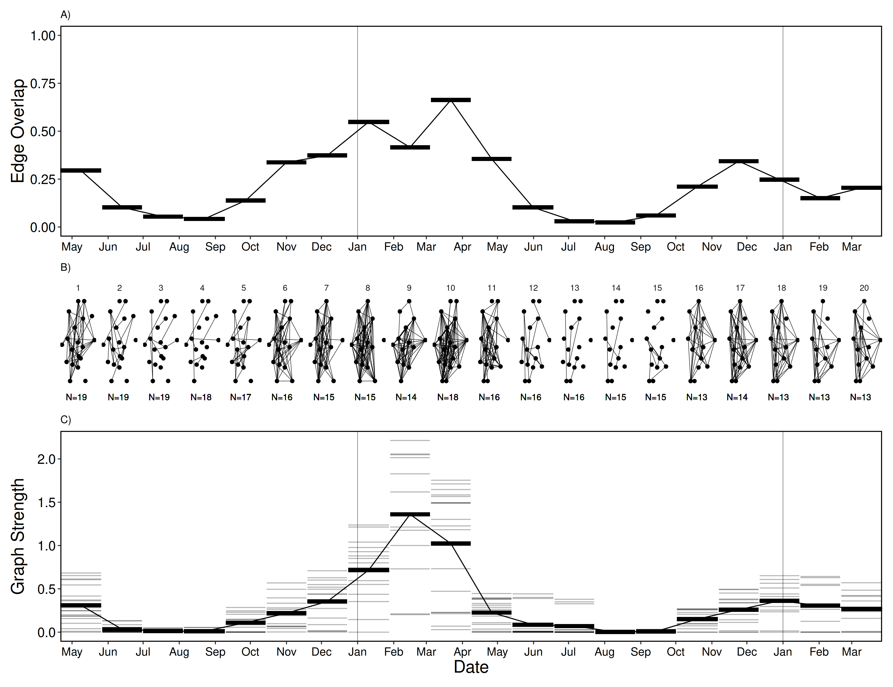

\newpage

```{r setup, include=FALSE}
knitr::opts_chunk$set(
    echo = FALSE,
    eval = TRUE,
    out.width = '\\linewidth'
)

library(data.table)

source('../scripts/00-variables.R')

options(digits = 2, round = 2)

DT <- readRDS('../data/derived-data/01-sub-fogo-caribou.Rds')
nobs <- readRDS('../data/derived-data/05-number-of-observations.Rds')
count <- readRDS('../data/derived-data/02-landcover-scale-count.Rds')
count[lc %in% c(1, 2, 3), percent := N / sum(N) * 100, by = res]
timedefs <- fread('../data/supp-data/timecut-defs.csv')
timedefs[, c('mindate', 'maxdate') := .(as.IDate(mindate), as.IDate(maxdate))]
```


# Abstract
Scale remains a foundational concept in ecology. Spatial scale, for instance,
has become a central consideration in the way we understand landscape ecology
and animal space use. Meanwhile, scale-dependent social processes can range from
fine-scale interactions to co-occurrence and overlapping home ranges.
Furthermore, sociality can vary within and across seasons. Multilayer networks
promise the explicit integration of the social, spatial and, temporal contexts.
Given the complex interplay of sociality and animal space use in heterogeneous
landscapes, there remains an important gap in our understanding of the influence
of scale on animal social networks. Using an empirical case study, we discuss
ways of considering social, spatial and, temporal scale in the context of
multilayer caribou social networks. Effective integration of social and spatial
processes, including biologically meaningful scales, within the context of
animal social networks is an emerging area of research. We incorporate
perspectives that link the social environment to spatial processes across scales
in a multilayer context.


## Keywords
Caribou, *Rangifer*, Social network analysis, Habitat selection, Landscape ecology, Space use 

\newpage

# Introduction
Our inferences regarding the processes underlying ecological patterns
are directly linked to the scale at which they are observed [@Levin_1992;
@Allen_2015]. Animals are influenced across scales by ecological processes such as
trophic interactions, resource availability
[@Legendre_1993; @Chave_2013], and global climate and productivity [@Field_2009].
Multiscale ecology has been integrated into species distribution modelling
[@Elith_2009], habitat selection [@Mayor_2007], and food webs [@Sugihara_1989].
We posit that it is important to consider the scale dependence of 
animal behaviour within the social environment to effectively understand 
complex social systems [@Whitehead_2008; @Webber_2018]. 

Social interactions exists across both temporal and spatial scales [Figure
\@ref(fig:spacetime), @Whitehead_2008]. For example, conspecific grooming
requires close spatial proximity and occurs over brief time periods 
[e.g. @Carter_2015], social associations represent shared space use by members of the
same social group over relatively longer time periods [@Franks_2009], and home
range overlap occurs over coarser spatial and temporal scales [e.g.
@Piza_Roca_2018]. Although the social environment scales spatially and
temporally, it remains unclear whether coarser scales of social behaviour, such
as social association and home range overlap, vary predictably 
[@Castles_2014; @Farine_2015a; @Evans_2019]. Thus, social scale is defined by 
the temporal and spatial scales across which different forms of sociality are measured
[@Farine_2015a].


Social network analysis is a well-developed tool used to measure the
relationships of individuals and organization of social systems [@Krause_2009;
@Wey_2008; @Croft_2011]. It provides insight into the structure of social
communities, which can influence population dynamics and evolutionary processes
[@Pinter_Wollman_2013; @Kurvers_2014]. Despite the widespread use and innovation
of traditional social network analysis [@Webber_2019], it typically considers
sociality in a singular context, drastically simplifying the complexity of
animal social systems [@Finn_2019]. Extending traditional monolayer social
networks, multilayer networks explicitly consider social systems across
scale-dependent contexts [@Pilosof_2017]. Multilayer networks are composed of
multiple layers, that can represent (i) different classes of individuals, e.g.
male or female, (ii) types of behaviours, e.g. grooming, travelling, or
foraging, (iii) spatial areas, e.g. local or regional, (iv) or temporal windows,
e.g. daily or seasonal [@Kivela_2014; @Porter_2018]. Multilayer networks are 
relatively novel to studies of animal behaviour [@Silk_2018; @Finn_2019] and 
integrating scale within multilayer networks remains an unexplored opportunity to develop 
novel understanding of animal social systems.

We examined scale-dependent multilayer networks of behavioural, landscape, and
spatial ecology and applied this framework to caribou (*Rangifer tarandus*).
First, we test to what degree the social scale of relationships, spatial scale
of landscapes, and temporal scale of analysis influences our ability to
interpret complex social systems. Second, we address how variation in social,
spatial, and temporal scales improves our understanding of the relationship
between social association and seasonal resource availability. We conclude with
potential future developments and applications of scale in multilayer networks.


(ref:spacetime) Space-time diagram representing variation the relative spatial and temporal extent required for different types of social and communication processes for four species, including spotted hyaena, passerine birds, sleepy lizards, and elephants. Spatial and temporal extent for social interactions, e.g. mating, grooming, or aggression, are similar for most species because physical contact between two individuals is required for many social interactions. The logical extension is that spatial and temporal extent for social interaction is hierarchically nested within the spatial and temporal extent for social association because individuals must share space to interact. By contrast, different species have potential for greater spatial and temporal extents, for example, temporal extent for vocal communication is similar for most species because most vocal calls only persist in the environment for seconds, but spatial extent for vocal communication is highly variable with elephant calls extending the great distance and passerine calls extending the shortest distance.


# Methods

## Caribou socioecology
Caribou are gregarious ungulates with fission-fusion dynamics [@Lesmerises_2018]
that display temporal and spatial variation in social networks [@Peignier_2019].
Caribou dig holes, termed craters, in winter to access forage beneath the snow
[@Bergerud_1974]. Cratering is presumed to be a costly behaviour [@Boertje_1985], and as a
result, caribou tend to occupy and re-use craters once they are established.
Importantly, craters exist on the landscape at multiple scales: the crater scale
(a single crater), the feeding area scale (multiple craters in close proximity),
and the winter range scale (all craters within an individual’s range)
[@Mayor_2009]. Access to forage is therefore heterogeneous in winter and depends
on snow cover and distribution of craters on the landscape. 

## Caribou location data
We used GPS location data collected from `r DT[, uniqueN(get(idcol))]` adult female caribou on Fogo Island, Newfoundland, Canada between 
`r DT[, format(min(datetime), '%B %Y')]` and `r DT[, format(max(datetime), '%B %Y')]`. 
Caribou were immobilized and fitted with global positioning
system (GPS) collars (Lotek Wireless Inc., Newmarket, ON, Canada, GPS4400M
collars, 1,250 g) as described by Schaefer and Mahoney [-@Schaefer_2013]. Collars were programmed to
collect location fixes every 2 hours. Prior to analyses, we subset GPS fixes
to remove all erroneous and outlier GPS fixes following
[@Bjorneraas_2010]. We did not collar all caribou in the herd; however, the
proportion of marked adult females was ~10% of all adult females and ~5% of all
individuals in the herd. We assumed these individuals were randomly distributed
throughout the population. Home range sizes for 
caribou on Fogo Island are on average 50.1 $km^2$ in winter and 17.5 $km^2$ in 
summer [@Peignier_2019].

## Landscape data and habitat classification
Land cover data were provided by the Newfoundland and Labrador Wildlife Division
[@Integrated_2013]. Available land cover classification
included nine habitat types at 30 m resolution. We reclassified the land cover
types into three categories using the R package `raster` [@Hijmans_2019]:
foraging, forest, and open habitats. Foraging habitat consisted of lichen,
forest habitat consisted of coniferous forest, conifer scrub, broad leaf forest,
and mixed-wood forest, while open habitat consisted of wetland, rocky barrens,
and anthropogenic areas. Water was excluded from all subsequent analyses.


## Caribou multilayer social networks

### Network layer construction
We generated proximity-based social networks using the R package `spatsoc`
[@Robitaille_2019] in `r substr(version$version.string, 1, 15)` [@R_Core_Team]. 
Typically for ungulates and other gregarious
mammals, the ‘chain rule’ is used for group assignment [@Croft_2008; @Kasozi_2020]. 
The chain rule is applied by assigning a group identifier to the union of
buffered GPS fixes collected at each two hour time step. As such, individuals in a group are within
the social distance threshold of at least one other though not necessarily all
other individuals [@Robitaille_2019]. Group assignment is defined using a 
temporal threshold of 5 minutes
and a social distance threshold of 50 m [@Peignier_2019; @Lesmerises_2018]. 
In all networks, individual caribou were represented as nodes and associations between
individuals were represented as edges. We weighted edges by the strength of 
association between individuals using the simple ratio index [SRI, @Cairns_1987]. 


### Network metrics 
We used a series of metrics to characterize the multilayer networks, focusing on
the role of individuals within layers and the similarity of edges across layers.
Within each layer, we calculated degree centrality, the number
of direct connections an individual has, and graph strength, the degree weighted 
by the strength of association. We calculated multidegree,
the sum of degree centrality of individuals across layers, an extension
of degree centrality to multiple layers [@Berlingerio_2012; @Kivela_2014]. 
Finally, we measured the similarity of layers by calculating edge
overlap. Edge overlap is defined as the proportion of edges present in each
network layer out of all observed edges  [@Battiston_2014]. Network metrics were
calculated using the R packages `igraph` [@Csardi_2006], `asnipe`
[@Farine_2019], `spatsoc` [@Robitaille_2019] and `data.table` [@Dowle_2019].


## Varying scale in multilayer networks

### Social scale

We generated multilayer networks across a series of social distance thresholds
for group assignment. Social distance thresholds (5, 25, 50, 75, 100, 250 and
500 m) represent a range of sensory modalities of caribou from visual 
to olfactory and auditory. Multilayer networks consisted
of the social association between `r DT[, uniqueN(get(idcol))]` individuals
across three habitat layers (foraging, forest, and open) for the entire study
period. At the finest scale, individuals within 5 m of one another were
considered in the same group, whereas at the coarsest scale, individuals within
500 m of one another were considered in the same group. Increasing social
distance threshold is a proxy for potential behavioural interactions 
that occur across these distances (eg. grooming through vocal communication). 
For every social distance threshold, we calculated
individual graph strength within habitat layers, and edge overlap and
multidegree across habitat layers.


### Spatial scale
To assess the influence of land cover spatial scale, we aggregated the land cover raster
using the R package `grainchanger` [@Graham_2019] across a series of scales 
(100 - 1000 m by steps of 100 m) using a modal moving window method [@Graham_2019a]. 
We assume 30 m and 100 m represents fine-scale decision making
for caribou [@Mayor_2007], while 500 - 1000 m represents the scale at which
caribou tend to select and avoid habitat [@Bastille_2018]. Multilayer networks
consisted of the social associations between `r DT[, uniqueN(get(idcol))]`
individuals across three habitat layers (foraging, forest and open) for the
entire study period. For each land cover scale, we calculated individual
graph strength within habitat layers, and edge overlap and multidegree
across habitat layers.


### Temporal scale
#### Time windows 
We used a temporal multilayer network to assess the seasonality of caribou
sociality. Multilayer networks consisted of the social associations between 
`r DT[, uniqueN(get(idcol))]` individuals across 20 ordinal sample periods from the
entire study period. For each time window, we calculated
individual graph strength within time windows, and edge overlap and
multidegree across time windows.


#### Number of observations
Studies of social network analysis vary in the number and frequency of
observations as well as the data collection technique used to generate networks,
ranging from directly observed to remotely sensed [@Davis_2018; @Webber_2019].
Remotely sensed GPS data are commonly collected at a fixed rate, e.g. every $x$
minutes or hours, continuously throughout the study period. Fix rate is a
reflection of number of observations an individual would have been observed and
recorded in traditional ethological studies. To investigate the influence of
number of observations, we generated multilayer networks of social association
between `r DT[, uniqueN(get(idcol))]` individuals across three habitat layers
(foraging, forest, and open) using $n$ randomly selected observations. We first
selected a maximum of 1000 timesteps and iteratively used $n$ of these ($n$ =
10 - 1000 observations by steps of 10), to ensure previously included timesteps,
and resulting associations, were accumulated with subsequent observations to
mimic collection of observational data. Within each multilayer network with $n$
observations, we calculated individual graph strength and multidegree. We
calculated edge overlap across the entire series of networks to determine
proportion of total edges as number of observations increased.


# Results
Individuals in multilayer networks became more connected as the social distance
threshold increased. Mean graph strength was higher in foraging and open layers
compared to forest layers (Figure \@ref(fig:socres)). Individual graph strength
increased when the social distance threshold increased from 5 m and 100 m in 
all three habitat layers followed by
a plateau in the rate of increase after 100 m (Figure \@ref(fig:socres)). These
results suggest the optimal social scale at which groups should be assigned is
between ~20 - 100 m based on the rate at which variance in graph strength
decreased. GPS data allowed  us to confirm the use of 50 m buffer 
[e.g. from this study and @Peignier_2019; @Lesmerises_2018] that has long been used
for studies of ungulate social behaviour in the field 
[@Lingle_2003; @Clutton_1982; @Kasozi_2020].


Increasing land cover resolution resulted in decreased availability of foraging
habitat and corresponding low connectivity of individuals in foraging layers
at higher land cover
resolutions. Edge overlap decreased sharply between 30 m and 600 m in foraging
layers, afterwards remaining stable to 1000 m (Figure \@ref(fig:lcres) D). In
contrast, edge overlap was relatively consistent in forest and open layers
as land cover resolution increased (Figure \@ref(fig:lcres) D). Graph strength was more
variable within foraging habitat layers across land cover resolutions than open
and forest habitat layers (Figure \@ref(fig:lcres) E). The proportion of
relocations in forest (`r count[res == 30 & lc == 2, percent]`% at 30 m - 
`r count[res == 1000 & lc == 2, percent]`% at 1000 m) and open 
(`r count[res == 30 & lc == 1, percent]`% at 30 m - 
`r count[res == 1000 & lc == 1, percent]`% at 1000 m) habitats increased 
with increasing spatial resolution, while decreasing in foraging habitat 
(`r count[res == 30 & lc == 3, percent]`% at 30 m
- `r count[res == 1000 & lc == 3, percent]`% at 1000 m). These results 
highlight the importance of matching land cover resolution to scale of
habitat selection and choosing a land cover product with a resolution
sufficient to detect less common habitats. 


The temporal multilayer network indicated within-year time windows where social
network metrics increased. Edge overlap was higher in between approximately 
November and May (time windows 1, 6-11 and
15-20) than between approximately June and October (time windows 2-5 and 12-15 
 (Figure \@ref(fig:temp) A). Time windows of higher edge overlap also had
higher graph strength compared to time windows of lower edge overlap, between
approximately June and October (Figure \@ref(fig:temp) C). Graph strength peaked
across the time series throughout winter 2018 (January to April). These results
highlight the importance of carefully selecting the temporal scale of analysis
to effectively capture within- and across-year variation in sociality.


As the number of observations used to generate multilayer networks increased,
individuals became more connected and variance in metrics decreased. Edge
overlap increased across all three habitat layers with increasing number of
observations (Figure \@ref(fig:nobs) B). Similarly, multidegree for all
individuals increased quickly between 10 and 100 observations and continued to
increase until 1000 observations (Figure \@ref(fig:nobs) C). Graph strength
across individuals in all three habitat layers was highly variable at low number
of observations and variance decreased after ~100 observations (Figure
\@ref(fig:nobs) A). Since the variance in these multilayer metrics decreases
after a certain number of observations, this sensitivity method could be useful
for determining the number of observations necessary for sufficiently describing
social dynamics across contexts.


An illustrative multilayer network was generated, informed by previous social, 
spatial, and temporal scale results (Figure \@ref(fig:ml)). Relocations were predominantly in open 
(`r count[res == 30 & lc == 1, percent]`%) and forest 
(`r count[res == 30 & lc == 2, percent]`%) habitats 
compared to foraging habitats (`r count[res == 30 & lc == 3, percent]`%). 
Despite lower proportion of relocations in foraging habitat, 
individuals were more strongly connected in foraging and open 
habitats than in forest (mean graph strength in habitat layers (SD); foraging: 0.21 (0.23), 
forest: 0.11 (0.13), open: 0.23 (0.24)). There was a seasonal difference in association with 
individuals more connected between approximately October - June 
(mean graph strength in time windows; 2: 0.37 (0.23), 4: 0.18 (0.11)) 
than between approximately June - October 
(mean graph strength in time windows; 1: 0.04 (0.04), 3: 0.03 (0.07)). The time windows
were aggregated from the finer scale time windows presented above (time window 1:
2-5, time window 2: 6-11, time window 3: 12-15, time window 4: 16-20).


<!-- Figure: metrics by social scale -->
(ref:socres) Varying scale in social distance threshold. For each social distance threshold (5, 25, 50, 75, 100, 250, 500 m), multilayer networks based on caribou social associations between `r DT[, format(min(datetime), '%B %Y')]` and `r DT[, format(max(datetime), '%B %Y')]` within three habitat layers (foraging, forest, and open). Each line represents a single individual and graph strength (mean of individuals in bold) showed a sharp increase between 5 m and 100 m for all habitat classes. After 100 m, graph strength continued to increase at a slower rate. Foraging and open layers showed higher variation in graph strength between individuals while forest layers had less variation and lower mean graph strength.


<!-- Figure: metrics by land cover resolution -->
(ref:lcres) Varying spatial scale of land cover raster. For each land cover resolution (100 - 500 m by steps of 100 m), multilayer networks based on caribou social associations between `r DT[, format(min(datetime), '%B %Y')]` and `r DT[, format(max(datetime), '%B %Y')]` within three habitat layers (foraging, forest, and open). A, B, C) Three land cover rasters: the original resolution (30 m) and two aggregated rasters (500 m and 1000 m). D) Edge overlap of habitat layers across spatial resolutions. Open and forest layers show consistent edge overlap with increasing spatial resolution while foraging shows a sharp decline in edge overlap between 30 m and 600 m. Above 600 m, edge overlap in foraging layers is stable. E) Graph strength within habitat layers across spatial resolutions showing individuals as a separate line and the mean of individuals in bold. Foraging layers showed high variation in graph strength with many individuals dropping to 0 after 500 m and others increasing with spatial resolution. Open layers and forest layers were relatively stable across spatial resolutions, with higher mean graph strength in open compared to forest layers.


<!-- Figure: Time window -->
(ref:temp) Varying temporal scale in multilayer networks. Multilayer networks based on caribou social associations within time windows (20 ordinal sample periods) between `r DT[, format(min(datetime), '%B %Y')]` and `r DT[, format(max(datetime), '%B %Y')]`. A) Edge overlap was high between approximately November and May (time windows 1, 6-11, 15-20) and low between approximately June and October (time windows 2-5 and 12-15). B) Ordinal network layers showing unweighted edges between individuals within time windows. Like edge overlap, individuals were more connected between November and May, compared to between June and October.  C) Graph strength within time windows showing individuals as thin grey lines and mean across individuals as thick black lines. Graph strength peaked in time window 9, with noticeable higher strength than the following year.


<!-- Figure: metrics by number of observations -->
(ref:nobs) Varying scale in number of observations. Multilayer networks based on a subset of observations (10 - 1000 observations by steps of 10) of caribou social associations between `r DT[, format(min(datetime), '%B %Y')]` and `r DT[, format(max(datetime), '%B %Y')]` within three habitat layers (foraging, forest, and open). A) Edge overlap increased for all habitat layers with increasing number of observations. Foraging and open layers had higher edge overlap than forest layers. B) Graph strength within habitat layers with increasing number of observations showing individuals as a separate line and the mean of individuals in bold. Graph strength was highly variable at low number of observations (less than 100) for all habitat layers and relatively stable after ~200 observations. C) Multidegree for all individuals increased with increasing number of observations. Individuals showed high variability (`r nobs[nobs == max(nobs), paste(range(multideg), collapse = ' - ')]`) at the maximal number of observations (1000).

<!-- Figure: Fogo ML Net -->
(ref:ml) Multilayer network representing social association of caribou across four time windows (approximately June 2017 - October 2017, November 2017 - May 2018, June 2018 - October 2018, November 2017 - March 2019)  and three habitat classes (foraging, forest, and open) informed by previous social, spatial and, temporal scale analyses. Individual caribou are represented as nodes in a constant position across network layers they were observed in. Intralayer edges represent association between individuals and line thickness is scaled by strength of association (SRI).


# Discussion
Animal social systems are characterized and influenced by scale (Figure \@ref(fig:ml)). Three types of
scale particularly relevant to animals are social, spatial, and temporal. Social scale defines
the type and measurement of social relationships and directly impacts observed
social connectivity between individuals. Spatial scale can reflect the
resolution of the habitat within which social interactions occur. Finally,
temporal scale relates to both study design and seasonal differences in
social processes. By partitioning social associations into discrete contexts
using multilayer networks, we highlight the influence of social, spatial, and
temporal scales on animal social systems, demonstrating the importance of
considering biologically relevant and robust scales.


Social scale is an essential consideration for social network analysis
[@Castles_2014; @Carter_2015; @Farine_2015a]. For example, networks can be
constructed based on fine-scale social interactions (e.g. grooming or
aggression), social associations (e.g. group membership or proximity), or
spatial or home range overlap. Here, we define social associations using a
series of social distance thresholds to generate proximity-based social
networks. Across habitat layers, increasing the social distance threshold
resulted in an increase in graph strength (Figure \@ref(fig:socres)).
Specifically, open and foraging layers had higher graph
strength as well as greater variation across individuals with larger social
distance thresholds. While our understanding of patterns of ungulate grouping 
across habitat types is relatively well-established [@Lingle_2003; @Kasozi_2020],
the ability to generate habitat-specific social networks provides novel 
inference given the ability to estimate inter- and intra-layer metrics. Furthermore,
generating socially variable layers within a multilayer framework emphasizes
that social scale directly influence multilayer network metrics. 
An extension of this analysis could incorporate behavioural states
to explore the influence of social scale on patterns of association or
interaction across habitat and behavioural layers e.g. using focal observations
or hidden Markov Models [see @Muller_2018; @Jones_2020].


Habitat selection, the use of available resources or landscape features by
animals [@Manly_1993; @Boyce_1999], is a scale-dependent process [@Mayor_2009]
that we can observe in multilayer networks.
Social structure and habitat selection are intimately related and individuals
must share space to interact [@Webber_2018]. We found edge overlap was stable in
open and forest layers but decreased in foraging layers as spatial
scale increased (Figure \@ref(fig:lcres) D). Graph strength had greater individual
variation in open and foraging layers than in forest layers (Figure
\@ref(fig:lcres) E). On average, graph strength was highest in foraging habitat, 
compared to forest and open habitat, despite the fact that foraging habitat was 
the least common. Furthermore, we observed a decrease in the proportion of relocations in
foraging habitat with increasing spatial resolution 
(`r count[res == 30 & lc == 3, percent]`% at 30 m - `r count[res == 1000 & lc == 3, percent]`% at 1000
m). As the foraging layer had similar edge overlap and graph strength as the
open layer at 30 m spatial resolution, spatial scale therefore played a
key role in our multilayer social networks. 
Johnson [-@Johnson_1980] identified four orders, or scales,  of habitat selection: (1) the
geographical range of a species, (2) the home range of an individual, the (3)
habitat patches within the home range and (4) specific resources within a
habitat patch. Scales of habitat selection could be relevant for multilayer networks and our
integration of habitat within a multilayer context could be an important first
step. Specifically, if individuals select habitats
at the home range scale - e.g. at coarser resolution, it may be relevant to assess social structure using
home range overlap. By contrast, in cases where individuals select habitats at
the patch-scale, fine-scale measures of sociality may be more relevant. Moving
past this hierarchical perspective, Mayor et al. [-@Mayor_2007] emphasized the
importance of considering a broad continuum of scales to reveal scale-dependent
selection and avoid the bias of predefined scales assumed to associate with
certain behaviours. We highlight the concept of scale in multilayer 
networks should be approached based on explicit and precise definitions
to ensure robust measurements. 


The emergent relationship between habitat and sociality has been explored by the
temporal distribution and phenology of resources and use of social information
in multilayer networks [e.g. @Evans_2020].
We observed seasonal variation in edge overlap. Specifically, we found 
increased edge overlap and graph strength in autumn, winter and spring than in summer 
(Figure \@ref(fig:temp) A, C). These periods of increased sociality correspond
to seasons of heterogeneous resource availability for caribou [@Peignier_2019]. This analysis
could be extended using time-aggregated networks and a moving-window approach for
informing time window size and sampling effort [@Farine_2017; @Bonnell_2020]. By
explicitly considering the temporal context of social interactions in separate
layers, multilayer networks provide a detailed and dynamic perspective of animal
social systems. For example, female mandrill (*Mandrillus sphinx*) sociality is
more completely represented by temporal multilayer networks than aggregated
networks [@Pereira_2020]. Evans et al. [-@Evans_2020] observed seasonal
differences in how the multilayer social structure of mice (*Mus musculus domesticus*) related
to genetic structure. Finally, it is crucial to include
sufficient data within sampling periods or time windows to construct robust
networks [@Farine_2017; @Proskurnikov_2017]. With increasing number of
observations, we found variance decreased in edge overlap and multidegree across
habitat layers and in graph strength within habitat layers (Figure
\@ref(fig:nobs)). As one might expect, dyads that only occasionally associated
were more likely to be recorded with increasing number of observations, demonstrating 
the value of this form of sensitivity analysis to social networks in general
and multilayer networks in particular.


Multilayer networks remain a nascent but powerful tool in animal behavioural
ecology. Silk et al. [-@Silk_2018] summarized some key multilayer questions in
animal behaviour research and, based on our study of scale, 
we conclude by posing an additional set of questions centered on scale in
behavioural, landscape, and spatial ecology:

1. How do multilayer social network metrics vary across social, spatial, and temporal scales and
at which scale might these influence fitness (Box 1)? Are some scales better predictors
for different fitness components, e.g. reproductive success or survival? 

2. Why do individuals associate more strongly with certain conspecifics in some
habitats? What is the role of movement in the context of habitat-specific social
networks?

3. How, and why, does the spatial scale of perception influence, e.g. auditory,
visual, or chemotaxis, influence the social environment? What is the role of
memory, and by extension social and spatial cognition, as animals navigate their
environment and make decisions about where to move next?


We show that multilayer social networks are (1) scale-dependent, and (2) useful
for identifying spatially or temporally specific social associations. When
employing multilayer networks, it is critical to consider a broad continuum of
social, spatial and, temporal scales to capture fully ecological processes and to
establish a clear link between biologically relevant scales of observation.


# Box 1
Social phenotype has been increasingly linked to individual fitness, including
in primates [@Brent_2017; @Thompson_2019], dolphins [@Stanton_2012;
@Stanton_2011], and birds [@McDonald_2007; @Royle_2012]. Social and temporal
scales have emerged as important variables for understanding the fitness
consequences of social network position [@Almeling_2016; @Berger_2015;
@Brent_2017; @Holekamp_2011].

Varying social scales can have different fitness outcomes for individuals.
Rhesus macaques (*Macaca mulatta*) had higher survivorship when they had fewer
stable social associates and grooming partners compared to many weak social 
associates [@Ellis_2019]. Typically individuals
must be associating to interact, and many studies assume that proximity is proxy
for interacting [@Farine_2015a]. For instance, baboons (*Papio* spp.) must be 
within close proximity of each other for grooming yet, other forms
of social interaction may occur over long-distances based on vocal or
olfactory signals [@Carter_2015]. It is possible to record social interactions that do not require
proximity using, for example, microphone arrays to construct long-distance
communication networks [@Snijders_2017].

Multilayer networks enable researchers to investigate similarities and differences
in social processes between discrete temporal windows. Changing social phenotypes over ontogeny can
affect fitness [@Berger_2015; @Brent_2017]. Individuals progress through
development at different rates [@Tarka_2018] and this variation can complicate
the selection of time windows. Considering fine temporal scales provides insight
across developmental stages that may otherwise be missed [@Turner_2020]. It remains
critical to carefully consider the effect of scale on the relationship
between an individual’s social network position and fitness using a temporal
scale based on the hypotheses being tested and logistical constraints.


# Acknowledgements

We respectfully acknowledge the territory in which data were collected and
analyzed as the ancestral homelands of the Beothuk and the Island of
Newfoundland as the ancestral homelands of the Mi’kmaq and Beothuk. We thank
members of the Newfoundland and Labrador Wildlife Division, including S. Moores,
B. Adams, W. Barney, and J. Neville for facilitating animal captures and for
logistical support in the field. We also thank all members of the Wildlife
Evolutionary Ecology Lab, including J. Hendrix, K. Kingdon, S. Boyle, J.
Balluffi-Fry, C. Prokopenko, I. Richmond, J. Hogg, and L. Newediuk for their
comments on previous versions of this manuscript as well as D. C. Schneider for
inspiration and helpful discussions about scale. Funding for this study was
provided by a Vanier Canada Graduate Scholarship to QMRW and a NSERC Discovery
Grant to EVW.


# Code Availability

Code for performing all multilayer social network analyses and generating the
figures is available at https://github.com/robitalec/scale-in-multilayer-networks 
[@Robitaille_2020] and released under the GNU General Public License 3.0. 
We depend on numerous R packages notably for the analysis: `igraph` [@Csardi_2006],
`data.table` [@Dowle_2019], `spatsoc` [@Robitaille_2019], `asnipe` [@Farine_2019],
and `grainchanger` [@Graham_2019], for the figures: `ggplot2` [@Wickham_2016] and
`patchwork` [@Pedersen_2019], and for reproducibility and workflow management: 
`drake` [@Landau_2018], `renv` [@Ushey_2020], and `knitr` [@Xie_2015]. 


\newpage

```{r spacetime, fig.cap='(ref:spacetime)'}
knitr::include_graphics('../graphics/figure-scales.png')
```


\newpage

```{r socres, fig.cap='(ref:socres)'}
knitr::include_graphics('../graphics/figure-soc.png')
```


\newpage

```{r lcres, fig.cap='(ref:lcres)'}
knitr::include_graphics('../graphics/figure-lc.png')
```

\newpage

```{r temp, fig.cap='(ref:temp)'}

```


\newpage

```{r nobs, fig.cap='(ref:nobs)'}
knitr::include_graphics('../graphics/figure-nobs.png')
```

\newpage


```{r ml, fig.cap='(ref:ml)'}
knitr::include_graphics('../graphics/figure-fogo-ml.png')
```

\newpage
\clearpage


# References