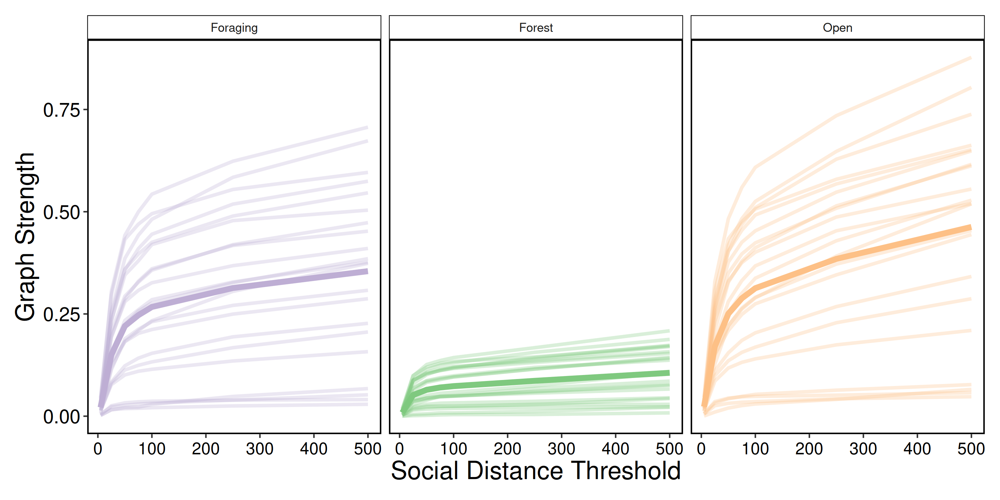

\newpage

```{r setup, include=FALSE}
knitr::opts_chunk$set(
    echo = FALSE,
    eval = TRUE,
    out.width = '\\linewidth'
)

library(data.table)

source('../scripts/00-variables.R')

DT <- readRDS('../data/derived-data/01-sub-fogo-caribou.Rds')
nobs <- readRDS('../data/derived-data/05-number-of-observations.Rds')
timedefs <- fread('../data/supp-data/timecut-defs.csv')
timedefs[, c('mindate', 'maxdate') := .(as.IDate(mindate), as.IDate(maxdate))]
```

\newpage

# Abstract
<!-- Scale remains a foundational concept in ecology. Social processes range from 
fine-scale interactions and co-occurrence to overlapping home ranges. Spatial 
scale has become a central consideration in the way we understand landscape ecology
and animal space use. Temporal variation in sociality and

Multilayer networks promise the explicit integration of social, 
spatial and temporal contexts of animal social networks. 

-->

Scale remains a foundational concept in ecology. Spatial scale, for instance,
has become a central consideration in the way we understand landscape ecology
and animal space use. Meanwhile, social processes can range from fine-scale
interactions to co-occurrence and overlapping home ranges. <!-- and vary within
and across seasons.--> Multilayer networks promise the explicit integration of
the social, spatial and temporal contexts. Given the complex interplay of
sociality and animal space use in heterogeneous landscapes, there remains an
important gap in our understanding of the influence of scale on animal social
networks. We discuss ways of considering social, spatial and temporal scale in
the context of multilayer caribou social networks. <!--We also present
perspectives on future development and applications of scale in multilayer
networks with respect to: phenotypes and individual fitness, movement ecology
and collective movement, and habitat selection and space use.--> Effective
integration of social and spatial processes, including biologically meaningful
scales, within the context of animal social networks is an emerging area of
research. We incorporate perspectives on how the social environment and spatial
processes are linked across scales in a multilayer context.


## Keywords
Social network analysis, Landscape ecology, Movement ecology, Space use 

\newpage

# Introduction
Our inference regarding the processes underlying ecological patterns
are directly linked to the scale at which they are observed [@Levin_1992;
@Allen_2015]. Animals are influenced across scales through ecological processes such as
trophic interactions, resource availability
[@Legendre_1993; @Chave_2013], and global climate and productivity [@Field_2009].
Multiscale ecology has been integrated into species distribution modelling
[@Elith_2009], habitat selection [@Mayor_2007], and food webs [@Sugihara_1989].
In the context of animal behaviour, certain behaviours
are scale-dependent; for example, acoustic communication in birds varies with
spatial scales [@Luther_2009]. We posit that it is important to consider that
animal behaviour within the social environment will be scale-dependent. 
<!-- QW: I think this last sentence needs to be a bit stronger. Why is it important? -->

Social interactions exists across both temporal and spatial scales [@Whitehead_2008]. For
example, grooming requires close spatial proximity between conspecifics and
occurs over brief time periods [e.g. @Carter_2015], whereas social associations
over long time periods 
represent shared space use by members of the same social group [Figure
\@ref(fig:spacetime), @Franks_2009]. Individuals must share space to 
interact or associate and thus have overlapping
home ranges [@Vander_2014]. Home
range overlap is an example of how animals share space over coarser spatial and
temporal scales <!-- TODO to create their social environment -->[e.g. @Piza_Roca_2018]. Although the social environment
clearly scales spatially and temporally, it remains unclear whether coarser
scales of social interactions, such as social association and home range overlap, vary
predictably [@Castles_2014; @Farine_2015a]. 
We therefore define social scale as the explicit definition 
and measurement of social relationships [@Farine_2015a]. 


Social network analysis is a well-developed tool used to measure the
relationships of individuals and organization of social systems [@Krause_2009;
@Wey_2008; @Croft_2011]. It provides insight into the structure of social
communities and social network properties, which can influence population
dynamics and evolutionary processes [@Pinter_Wollman_2013; @Kurvers_2014]. 
Despite the widespread use and innovation of traditional social
network analysis [@Webber_2019], it typically considers a single scale of
sociality in a monolayer network, drastically simplifying the complexity of
animal social systems [@Finn_2019].


Extending traditional monolayer social networks, multilayer networks explicitly
consider social systems across scale-dependent contexts [@Pilosof_2017].
Multilayer networks are composed of multiple layers, each representing (i)
different classes of individuals, e.g. male or female, (ii) types of behaviours,
e.g. grooming, travelling, or foraging, (iii) spatial areas, e.g. local or
regional, (iv) or temporal windows, e.g. daily or seasonal 
[@Kivela_2014; @Porter_2018]. Multilayer networks are relatively novel to studies of animal
behaviour [@Silk_2018; @Finn_2019], although they have been used to describe
multidimensional human social systems, complex transportation networks, and
neural networks [@Kivela_2014]. Scale within multilayer social networks remains
unexplored but provides a unique opportunity to develop novel understanding of
variation in the social, spatial, or temporal scales associated with social
systems.

We examined scale-dependent multilayer networks motivated by behavioural,
landscape, and spatial ecology to and applied this framework to caribou
(*Rangifer tarandus*) on Fogo Island, Newfoundland, Canada. First, we test to
what degree the social scale of relationships, spatial scale of landscapes, and
temporal scale of analysis influences our ability to interpret complex social
systems. Second, we address how variation in the social, spatial, and temporal
scale improves our understanding of the relationship between social association
and seasonal resource availability. We conclude with potential future
developments and applications of scale in multilayer networks.


(ref:spacetime) Space-time diagram representing variation the relative spatial and temporal extent required for different types of social and communication processes for four species, including spotted hyaena, passerine birds, sleepy lizards, and elephants. Spatial and temporal extent for social interactions, e.g. mating, grooming, or aggression, are similar for most species because physical contact between two individuals is required for many social interactions. The logical extension is that spatial and temporal extent for social interaction is hierarchically nested within the spatial and temporal extent for social association because individuals must share space to interact. By contrast, different species have potential for greater spatial and temporal extents, for example, temporal extent for vocal communication is similar for most species because most vocal calls only persist in the environment for seconds, but spatial extent for vocal communication is highly variable with elephant calls extending the great distance and passerine calls extending the shortest distance.


# Methods

## Caribou socioecology
Caribou are gregarious ungulates with fission-fusion dynamics [@Lesmerises_2018]
that display temporal and spatial variation in social networks [@Peignier_2019].
In winter, caribou dig holes, termed craters, to access forage beneath the snow
[@Bergerud_1974]. Cratering is presumed to be a costly behaviour, and as a
result, caribou tend to occupy and re-use craters once they are established.
Importantly, craters exist on the landscape at multiple scales: the crater scale
(a single crater), the feeding area scale (multiple craters in close proximity),
and the winter range scale (all craters within an individual’s range)
[@Mayor_2009]. Access to forage is therefore heterogeneous in winter depending
on snow cover and distribution of craters on the landscape.

## Caribou location data
We used GPS location data collected from Fogo Island caribou between 
`r DT[, format(min(datetime), '%B %Y')]` and `r DT[, format(max(datetime), '%B %Y')]`. 
Adult female caribou were immobilized and fitted with global positioning
system (GPS) collars (Lotek Wireless Inc., Newmarket, ON, Canada, GPS4400M
collars, 1,250 g) as described by [@Schaefer_2013]. Collars were programmed to
collect location fixes every 2 hours. Prior to analyses, we subset GPS fixes
to remove all erroneous and outlier GPS fixes following
[@Bjorneraas_2010]. We did not collar all caribou in the herd; however, the
proportion of marked adult females was ~10% of all adult females and ~5% of all
individuals in the herd. We assumed these individuals were randomly distributed
throughout the population.

## Landscape data and habitat classification
Land cover data were provided by the Newfoundland and Labrador Wildlife Division
[@Integrated_2013]<!--TODO: check ref-->. Available land cover classification
included nine habitat types at 30 m resolution. We reclassified the land cover
types into three categories using the R package `raster` [@Hijmans_2019]:
foraging, forest, and open habitats. Foraging habitat consisted of foraging,
forest habitat consisted of coniferous forest, conifer scrub, broad leaf forest,
and mixed-wood forest, while open habitat consisted of wetland, rocky barrens,
and anthropogenic. Water habitat was excluded from all subsequent analyses.


## Caribou multilayer social networks

### Network layer construction
We generated proximity-based social networks using the R package `spatsoc`
[@Robitaille_2019] in `r substr(version$version.string, 1, 15)` [@R_Core_Team]. We assumed
individuals were associating if simultaneous GPS fixes were within the spatial
distance threshold of one another. Typically for ungulates and other gregarious
mammals, the ‘chain rule’ is used for group assignment [@Croft_2008]. For GPS
data, the chain rule is applied by assigning a group identifier to the union of
buffered GPS fixes at each time step. As such, individuals in a group are within
the social distance threshold of at least one other though not necessarily all
other individuals [@Robitaille_2019]. <!-- TODO: check jwt comment--> Group assignment based on the chain rule
has previously been applied to caribou using a temporal threshold of 5 minutes
and a social distance threshold of 50 m [@Peignier_2019; @Lesmerises_2018]. In
all networks, individual caribou were represented as nodes and associations between
individuals in a given network layer were represented as intralayer
edges.


We weighted edges of social networks by the strength of association between
caribou using the simple ratio index [SRI, @Cairns_1987]:

$$ SRI = \frac{x}{x + y_{AB} + y_{A} + y_{B}} $$

where x is the number of fixes where individuals A and B were in the same group,
$y_{A}$ is the number of fixes from individual A when individual B did not have
a simultaneous fix, $y_{B}$ is the number of fixes from individual B when
individual A did not have a simultaneous fix, and $y_{AB}$ is the number of
simultaneous fixes from individuals A and B that were separated by more than the
social distance threshold [@Farine_2015].


### Network metrics 
We used a series of metrics to characterize the multilayer networks, focusing on
the role of individuals within and across layers, and the similarity of
different layers. To measure the role of individuals within layers, we
calculated degree centrality and graph strength. Degree centrality is the number
of direct connections an individual has to other individuals in a network layer.
Graph strength is the degree weighted by the strength of association, in this
case SRI, in each layer. We calculated multidegree,
the sum of degree centrality of individuals across layers, an extension
of degree centrality to multiple layers [@Berlingerio_2012;
@Kivela_2014]. Finally, we measured the similarity of layers by calculating edge
overlap. Edge overlap is defined as the proportion of edges present in each
network layer out of all observed edges  [@Battiston_2014]. Network metrics were
calculated using the R packages `igraph` [@Csardi_2006], `asnipe`
[@Farine_2019], `spatsoc` [@Robitaille_2019] and `data.table` [@Dowle_2019].


## Varying scale in multilayer networks

### Social scale

We generated multilayer networks across a series of social distance thresholds
for group assignment. Social distance thresholds (5, 25, 50, 75, 100, 250 and
500 m) represented a range of visual (short distance) to olfactory and long
distance auditory sensory modalities of caribou. Multilayer networks consisted
of the social association between `r DT[, uniqueN(get(idcol))]` individuals
across three habitat layers (foraging, forest, and open) for the entire study
period. At the finest scale, individuals within 5 m of one another were
considered in the same group, whereas at the coarsest scale, individuals within
500 m of one another were considered in the same group. Increasing social
distance threshold is a proxy for potential behavioural interactions that occur
across these distances. For every social distance threshold, we calculated
individual graph strength within each habitat layer, and edge overlap and
multidegree across habitat layers.


### Spatial scale
To assess the influence of spatial scale, we aggregated the land cover raster
using the R package `grainchanger` [@Graham_2019] across a series of scales (100
- 1000 m by steps of 100 m). The land cover raster was aggregated using a modal
moving window method using a circular window corresponding to the above scales
[@Graham_2019a]. We assume 30 m and 100 m represents fine-scale decision making
for caribou during foraging, while re-sampling at 500 m , 750 m and 1000 m
represents the scale at which caribou tend to select and avoid habitat
(Bastille-Rousseau et al. 2017). Multilayer networks consisted of the social
associations between `r DT[, uniqueN(get(idcol))]` individuals across three
habitat layers (foraging, forest and open) for the entire study period. For each
land cover resolution, we calculated individual graph strength within each
habitat layer, and edge overlap and multidegree across habitat layers.


### Temporal scale
#### Time windows 
We used a temporal multilayer network to assess the seasonality of caribou
sociality. Multilayer networks consisted of the social associations between 
`r DT[, uniqueN(get(idcol))]` individuals across 20 ordinal sample periods from the
entire study period. Social associations were defined by spatiotemporal overlap
of individuals within 5 minutes and 50 m. For each time window, we calculated
individual graph strength within each time window, and edge overlap and
multidegree across time windows.


#### Number of observations
Studies of social network analysis vary in the number and frequency of
observations as well as the data collection technique used to generate networks,
ranging from directly observed to remotely sensed [@Davis_2018; @Webber_2019].
Remotely sensed GPS data is commonly collected at a fixed rate, e.g. every $x$
minutes or hours, continuously throughout the study period. Fix rate is a
reflection of number of observations an individual would have been observed and
recorded in traditional ethological studies. To investigate the influence of
number of observations, we generated multilayer networks of social association
between `r DT[, uniqueN(get(idcol))]` individuals across three habitat layers
(foraging, forest, and open) using $n$ randomly selected observations. We first
generated a maximum of 1000 timesteps and iteratively used $n$ of these ($n$ =
10 - 1000 observations by steps of 10), to ensure previously included timesteps,
and resulting associations, were accumulated with subsequent observations to
mimic collection of observational data. Within each multilayer network with $n$
observations, we calculated individual graph strength and multidegree. We
calculated edge overlap across the entire series of networks to determine
proportion of total edges as number of observations increased.


# Results
<!-- TODO intro + ml fig -->

Individuals in multilayer networks became more connected as the social distance
threshold increased. Mean graph strength differed across habitat layers with
similar and higher graph strength in foraging and open layers, and lower
strength in forest layers (Figure \@ref(fig:socres)). Individual graph strength
increased sharply between 5 m and 100 m in all three habitat classes followed by
a plateau in the rate of increase after 100 m (Figure \@ref(fig:socres)). These
results suggest the optimal social scale at which groups should be assigned is
between ~20 - 100 m based on the rate at which variance in graph strength
decreased. GPS data allows [e.g. from this study and @Peignier_2019; @Lesmerises_2018] 
us to confirm the use of 50 m buffer that has long been used
for studies in the field [@Lingle_2003; @Clutton_1982].


Increasing land cover resolution resulted in decreased availability of foraging
habitat and corresponding low connectivity of individuals at higher land cover
resolutions. Edge overlap decreased sharply between 30 m and 600 m in foraging
layers, afterwards remaining stable to 1000 m (Figure \@ref(fig:lcres) D). In
contrast, edge overlap was relatively consistent across land cover resolutions
in forest and open layers (Figure \@ref(fig:lcres) D).  Graph strength was more
variable within foraging habitat layers across land cover resolutions than open
and forest habitat layers (Figure \@ref(fig:lcres) E). The proportion of
relocations in forest (42.1% at 30 m - 48.2% at 1000 m) and open (43.3% at 30 m
- 50.3% at 1000 m) habitats increased with increasing spatial resolution, while
decreasing in foraging habitat (23.9% at 30 m - <2% at 1000 m).  <!-- TODO: 
break up -->Overall, these
results indicate the importance of matching land cover resolution to scale of
habitat selection as well as ensuring the land cover product used has a resolution fine
enough to detect landscape features and habitats relevant to study species, such
as important patchy and rare habitats.


The temporal multilayer network indicated within-year time windows where social 
network metrics increased. Edge overlap was higher in time windows 1, 6-11 and 
15-20 than in time windows 2-5 and 12-15 
(Figure \@ref(fig:temp) A). Time windows of higher edge overlap, between 
approximately October and June, also had higher graph strength 
compared to time windows of lower edge overlap, between approximately June 
and October (Figure \@ref(fig:temp) C). Graph strength peaked across the time 
series between January 2018 and April 2018. 
These results suggest that ordinal multilayer networks can effectively 
capture discrete time windows of aggregation and dissaggregation related 
to resource availability, and highlight the importance of carefully 
selecting the temporal scale of analysis. <!-- TODO see comment-->

As the number of observations used to generate multilayer networks increased,
individuals became more connected and variance in metrics decreased.
Edge overlap increased across all three habitat
layers with increasing number of observations (Figure \@ref(fig:nobs) B).
Similarly, multidegree for all individuals increased quickly between 10 and 100
observations, and continued to increase until 1000 observations (Figure
\@ref(fig:nobs) C). Graph strength across individuals in all three habitat layers was highly
variable at low number of observations and variance decreased after ~100 observations
(Figure \@ref(fig:nobs) A). <!--TODO double check-->Since the variance in these 
multilayer metrics decreases after a certain number
of observations, this sensitivity method could be useful for determining the
number of observations necessary for sufficiently describing social dynamics
across contexts.


<!-- Figure: metrics by social scale -->
(ref:socres) Varying scale in social distance threshold. For each social distance threshold (100 - 1000 m by steps of 100 m), multilayer networks were constructed of caribou social associations (n = `r DT[, uniqueN(get(idcol))]` females) on Fogo Island, Newfoundland between `r DT[, format(min(datetime), '%F')]` and `r DT[, format(max(datetime), '%F')]` within three habitat layers (foraging, forest, and open). Graph strength (mean of individuals in bold) showed a sharp increase between 5 m and 100 m for all habitat classes. After 100 m, graph strength continued to increase at a slower rate. Foraging and open layers showed higher variation in graph strength between individuals while forest layers had less variation and lower mean graph strength.


<!-- Figure: metrics by land cover resolution -->
(ref:lcres) Varying spatial scale of land cover raster. For each land cover resolution (5, 25, 50, 75, 100, 250 and 500 m), multilayer networks were constructed of caribou social associations (n = `r DT[, uniqueN(get(idcol))]` females) on Fogo Island, Newfoundland between `r DT[, format(min(datetime), '%F')]` and `r DT[, format(max(datetime), '%F')]` within three habitat layers (foraging, forest, and open). A, B, C) Three land cover rasters: the original resolution (30 m) and two aggregated rasters (500 m and 1000 m). D) Edge overlap of habitat layers across spatial resolutions. Open and forest layers show consistent edge overlap with increasing spatial resolution while foraging shows a sharp decline in edge overlap between 30 m and 600 m. Above 600 m, edge overlap in foraging layers is stable. E) Graph strength (mean of individuals in bold) within habitat layers across spatial resolution. Foraging layers showed high variation in graph strength with many individuals dropping to 0 after 500 m and others increasing with spatial resolution. Open layers and forest layers were relatively stable across spatial resolutions, with higher mean graph strength in open compared to forest layers.


<!-- Figure: metrics by number of observations -->
(ref:nobs) Varying scale in number of observations. Multilayer networks were generated using a  subset of observations (10 - 1000 observations by steps of 10) of caribou social associations (n = `r DT[, uniqueN(get(idcol))]` females) on Fogo Island, Newfoundland between `r DT[, format(min(datetime), '%F')]` and `r DT[, format(max(datetime), '%F')]` within three habitat layers (foraging, forest, and open). A) Edge overlap increased for all habitat layers with increasing number of observations. Foraging and open layers had higher edge overlap than forest layers. B) Graph strength was highly variable at low number of observations (less than 100) for all habitat layers and relatively stable after ~200 observations. C) Multidegree increased for all individuals with increasing number of observations. Individuals showed high variability (`r nobs[nobs == max(nobs), paste(range(multideg), collapse = ' - ')]`) at the maximal number of observations (1000).


<!-- Figure: Time window -->
(ref:temp) Varying temporal scale in multilayer networks. Multilayer networks were generated of caribou social associations (n = `r DT[, uniqueN(get(idcol))]` females) on Fogo Island, Newfoundland within time windows (20 ordinal sample periods of 35-36 days) between `r DT[, format(min(datetime), '%F')]` and `r DT[, format(max(datetime), '%F')]`. A) Edge overlap across time windows showed two periods of low overlap (time windows 2-5 and 12-15), and three periods of high overlap (time windows 1, 6-11, 15-20). B) Ordinal network layers showing unweighted edges between individuals within time windows. Like edge overlap, individuals were more connected in time windows 1, 6-11, and 15-20, compared to 2-5 and 12-15. Number of individuals in each time window is reported below each layer. C) Graph strength within time windows showing individuals as thin grey lines and mean across individuals as thick black lines. Graph strength peaked in time window 9, with noticeable higher strength than the following year.


<!-- Figure: Fogo ML Net -->
(ref:ml) Multilayer network representing social association of caribou on Fogo Island, Newfoundland between `r DT[, format(min(datetime), '%B %Y')]` and `r DT[, format(max(datetime), '%B %Y')]`. Individual caribou (n = `r DT[, uniqueN(get(idcol))]` females) are represented as nodes in a constant location in layers they were observed. Twelve layers represent combinations of four time windows and three habitat classes (foraging, forest, and open) informed by previous social, spatial and temporal scale analyses. Intralayer edges represent association between individuals and line thickness is scaled by strength of association (SRI).


# Discussion
<!--
1. intro
TODO: somewhere ref:ml
-->


<!-- intro -->
Animal social systems are characterized and influenced by scale. Three types of
scale to consider are social, spatial, and temporal scale. Social scale defines
the type and measurement of social relationships and directly impacts observed
social connectivity between individuals. Spatial scale can reflect the
resolution of the habitat within which social interactions occur. Finally,
temporal scale is related to both study design and seasonal differences in
social processes. By partitioning social associations into discrete contexts
using multilayer networks, we highlight the influence of social, spatial and
temporal scales on animal social systems, demonstrating the importance of
considering biologically relevant and robust scales.
<!-- intro -->


<!-- social scale -->
Social scale is an essential consideration for social network analysis
[@Castles_2014; @Carter_2015; @Farine_2015a]. For example, networks can be
constructed based on fine-scale social interactions (e.g. grooming or
aggression), social associations (e.g. group membership or proximity), or
spatial or home range overlap. Here, we define social associations using a
series of social distance thresholds to generate proximity-based social
networks. Across network layers, increasing the social distance threshold
resulted in an increase in graph strength (Figure \@ref(fig:socres)).
Specifically, the strength of social associations across habitat layers, with
open and foraging habitats demonstrating a more pronounced increase in graph
strength as well as greater variation across individuals. These results
emphasize that multilayer network metrics are directly influenced by social
scale. An extension of this analysis could be to incorporate behavioural states
to explore the influence of social scale on patterns of association or
interaction across habitat and behavioural layers [e.g. using focal observations
or hidden Markov Models see @Muller_2018; @Jones_2020].
<!-- social scale -->


<!-- spatial -->
Habitat selection, the use of available resources or landscape features by
animals [@Manly_1993; @Boyce_1999], is a scale-dependent process [@Mayor_2009].
Social structure and habitat selection are intimately related and individuals
must share space to interact [@Webber_2018]. We found edge overlap was stable in
open and forest layers but decreasing in foraging layers with increasing spatial
scale (Figure \@ref(fig:lcres) D). Graph strength had greater individual
variation in open and foraging layers than in forest layers (Figure
\@ref(fig:lcres) E). We observed a decrease in the proportion of relocations in
foraging habitat with increasing spatial resolution (23.9% at 30 m - <2% at 1000
m). As the foraging layer had similar edge overlap and graph strength as the
open layer at 30 m spatial resolution despite having lower abundance on the
landscape (foraging: 12.8%, open: 36.9%), this highlights the importance
of considering spatial scale when including habitat in multilayer networks.
Johnson [-@Johson_1980] identified four orders of habitat selection: (1) the
geographical range of a species, (2) the home range of an individual, the (3)
habitat patches within the home range and (4) specific resources within a
habitat patch. Kie et al. [-@Kie_2002] found that, independently, third order of
selection was insufficient for capturing landscape attributes selected for by
mule deer (*Odocoileus hemionus*), at a scale larger than their home range size.
Scales of habitat selection could be relevant for multilayer networks and our
integration of habitat within a multilayer context could be an important first
step (see Figure \@ref(fig:lcres)). Specifically, if individuals select habitats
at the home range scale, it may be relevant to assess social structure using
home range overlap. By contrast, in cases where individuals select habitats at
the patch-scale, fine-scale measures of sociality may be more relevant. Moving
past this hierarchical perspective, Mayor et al. [-@Mayor_2007] emphasized the
importance of considering a broad continuum of scales to reveal scale-dependent
selection and avoid the bias of predefined scales assumed to be associated with
certain behaviours.
<!-- spatial -->


<!-- temp -->
The emergent relationship between habitat and sociality has been explored by the
temporal distribution and phenology of resources and use of social information.
We found increased edge overlap and graph strength in fall, winter and spring
(approximately October - June) than in summer (approximately June - October)
(Figure \@ref(fig:temp) A, C). These periods of increased sociality correspond
to seasons of heterogeneous resource availability [Peigner_2019]. This analysis
could be extended using time-aggregated networks and a moving-window approach to
time window size and sampling effort [@Farine_2017; @Bonnell_2020]. By
explicitly considering the temporal context of social interactions in separate
layers, multilayer networks provide a detailed and dynamic perspective of animal
social networks. For example, female mandrill (*Mandrillus sphinx*) sociality is
more completely represented by temporal multilayer networks than aggregated
networks [@Pereira_2020]. Evans et al. [-@Evans_2020] observed seasonal
differences in the social structure of mice (*Mus musculus domesticus*) related
to temperature and breeding activity. Finally, it is crucial to include
sufficient data within sampling periods or time windows to construct robust
networks [@Farine_2017; Proskurnikov_2017]. With increasing number of
observations, we found variance decreased in edge overlap and multidegree across
habitat layers as well as in graph strength within habitat layers (Figure
\@ref(fig:nobs)). As more observations were added, rarer relationships were
recorded demonstrating the value of this form of sensitivity analysis.
<!-- temp -->


<!-- Finally, due to the autocorrelated nature of biologging data it is -->
<!-- essential to ensure social association data area non-randomly distributed -->
<!-- [@Farine_2017b]. -->


<!-- conclusion -->
Recognition of scale as a fundamental concept in ecology [@Levin_1992] has lead
to an increased attention to the scale at which ecological processes are
observed [@Schneider_2001; @Chave_2013]. Recent technological advances in
remotely sensed imagery [@Drusch_2012] and animal tracking devices
[@Borger_2020; @B_rger_2016; @Wikelski_2007] have increased the availability of
complex, high resolution data. We highlight ways in which scale should be
considered when building social networks from both observed and remotely-sensed
data. Our multilayer network analysis of caribou sociality incorporating high
resolution GPS telemetry data and spatial land cover data is grounded in the
context of observed animal behaviour as the scales we chose to explore, e.g.,
number of observations and sociality across space and time, are ones that have
also traditionally been done in ethology.

Multilayer networks remain a nascent but powerful tool in animal behavioural
ecology and we introduce concepts of scale within the existing multilayer
framework. Silk et al. [-@Silk_2018] summarized some key multilayer questions in animal
behaviour research  and based on our case study of scale in the context of
multilayer networks, we conclude by posing an additional set of questions on the
future of multilayer networks through the lens of scale and behavioural,
landscape, and spatial ecology:

1. How do social phenotypes vary across social, spatial, and temporal scales and
at which scale might these influence fitness? Are some scales better predictors
for different fitness metrics? 

2. Why do individuals associate more strongly with certain conspecifics in some
habitats? What, if any, is the role of movement in the context of habitat
networks?

3. How, and why, does the spatial scale of perception influence, e.g. auditory,
visual, or chemotaxis, influence the social environment? What is the role of
memory, and by extension social and spatial cognition, as animals navigate their
environment and make decisions about where to move next?

We show that multilayer social networks are (1) scale-dependent, and (2) useful
for identifying spatially or temporally specific social associations. When
employing multilayer networks, it is critical to consider a broad continuum of
social, spatial and temporal scales to fully capture ecological processes and to
establish a clear link between biologically relevant scales of observation.
<!-- conclusion -->


<!-- TODO include mov elsewhere 
Social processes, movement decisions, and space use are inextricably linked and
multilayer networks represent a potential analytical framework for linking these
processes [@Mourier_2019]. 

Integrating habitat-specific
movement layers could further illuminate the role of movement as a driver of the
social and spatial environments an individual experiences [@Webber_2018]. 
-->


# Box 1
Social phenotype has been increasingly linked to individual fitness, including
in primates [@Brent_2017; @Thompson_2019], dolphins [@Stanton_2012;
@Stanton_2011], and birds [@McDonald_2007; @Royle_2012]. Social and temporal
scales have emerged as important variables for understanding the fitness
consequences of social network position [@Almeling_2016; @Berger_2015;
@Brent_2017; @Holekamp_2011].

Varying social scales can have different fitness repercussions for individuals.
Rhesus macaques (*Macaca mulatta*) had higher survivorship when they had fewer
but stronger and more stable social associates and grooming partners rather than
simply more associates [@Ellis_2019].  It is a common trope that individuals
must be associating to interact, and many studies assume that proximity is proxy
for interacting [@Farine_2015a]. For instance, baboons must be within proximity
of each other for grooming yet other animals interact using communication
such as long-distance vocalization or olfactory signals 
[@Carter_2015]. It is possible to record social interactions that do not require
proximity using, for example, microphone arrays to construct long-distance
communication networks [@Snijders_2017].

Multilayer networks enable researchers to look at similarities and differences
between discrete temporal windows. Changing social phenotypes over ontogeny can
affect fitness [@Berger_2015; @Brent_2017]. Individuals progress through
development at different rates [@Tarka_2018] and this variation can complicate
the selection of time windows. Considering fine temporal scales provides insight
across developmental stages that may otherwise be missed [@Turner_2020]. Thus,
it is critical to carefully consider the effect of scale on the relationship
between an individual’s social network position and fitness using a temporal
scale based on the hypotheses being tested and logistical constraints.


# Acknowledgements

We thank all members of the Wildlife Evolutionary Ecology Lab, including J.
Hendrix, K. Kingdon, S. Boyle, J. Balluffi-Fry, C. Prokopenko, I. Richmond, J.
Hogg, and L. Newediuk for their comments on previous versions of this manuscript
as well as D. C. Schneider for inspiration and helpful discussions about scale.
Funding for this study was provided by a Vanier Canada Graduate Scholarship to
QMRW and a NSERC Discovery Grant to EVW.

\newpage

```{r spacetime, fig.cap='(ref:spacetime)'}

```


\newpage

```{r socres, fig.cap='(ref:socres)'}

```


\newpage

```{r lcres, fig.cap='(ref:lcres)'}
knitr::include_graphics('../graphics/figure-lc.png')
```

\newpage

```{r temp, fig.cap='(ref:temp)'}
knitr::include_graphics('../graphics/figure-temp.png')
```


\newpage

```{r nobs, fig.cap='(ref:nobs)'}
knitr::include_graphics('../graphics/figure-nobs.png')
```

\newpage


```{r ml, fig.cap='(ref:ml)'}
knitr::include_graphics('../graphics/figure-fogo-ml.png')
```

\newpage
\clearpage


# References