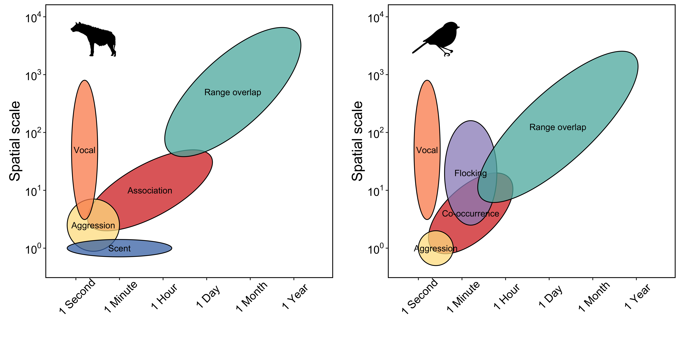

The problem and promise of scale in multilayer networks
================
Alec L. Robitaille1, Quinn M.R. Webber2, Julie W.
Turner1, Eric Vander Wal1,2

1Department of Biology, Memorial University of Newfoundland,
Canada; 2Cognitive and Behavioural Ecology Interdisciplinary
Program, Memorial University of Newfoundland

## Abstract

Scale remains a seminal concept in ecology. Spatial scale, for instance,
has become a central consideration in the way we understand landscape
ecology and animal space use. Meanwhile, social processes can also scale
from fine-scale interactions to co-occurrence and overlapping home
ranges. Multilayer networks promise the integration of monolayer animal
social networks with the complexity and importance of animal movement
and space use in heterogeneous landscapes. Despite the complex interplay
between social networks and how animals use space, there remains an
important biological and methodological gap in our understanding of an
animal’s perception of spatial scale, e.g., grain and extent, can affect
multilayer network dynamics. Here, we discuss the role of scale in the
context of multilayer networks and provide a case study of caribou
(*Rangifer tarandus*) to illustrate the role of social, spatial,
temporal scale on multilayer processes. We also present perspectives on
future development and application of scale in multilayer networks with
respect to habitat selection and space use, individual fitness and
phenotypes, and movement ecology and collective movement.Effective
integration of social and spatial processes, including biologically
meaningful scales, within the context of animal social networks is an
emerging area of research; our contribution will uniquely incorporate
perspectives on how the social environment and spatial processes are
linked across scales in a multilayer framework. Based on social network
and behavioural ecology theory as well as our case study, we demonstrate
potential for interconnectedness among individual animals, their social
environment, and the landscapes they occupy.

## Introduction

Our understandings of ecological pattern and process are directly linked
to the scale at which they are observed (Levin 1992; Allen et al. 2015).
Animals and landscapes are influenced across scales processes as global
as climate and productivity (Field et al. 2009), and species-specific as
trophic interactions and resource availability (Legendre 1993; Chave
2013). The effect of scale in ecology has been explored through species
distribution modelling (Elith et al. 2009), habitat selection (Mayor et
al. 2007), and food webs (Sugihara et al. 1989). Scale can be considered
throughout ecology, including animal behaviour and the social
environment that animals experience.

Sociality exists across scales (Whitehead 2008). For example, grooming
and mating relationships require close proximity between conspecifics
and occur over brief time periods (e.g. Carter et al. 2015), whereas
social association represents shared space use by members of the same
social group (Franks et al. 2010). Further, for social interactions or
associations to occur individuals must share space, and thus have
overlapping home ranges. In the context of the social environment, home
range overlap is a relatively coarse scale of sociality across which
individuals share space over larger spatial and temporal scales
(e.g. Piza-Roca et al. 2018). Although the social environment clearly
scales spatially and temporally, it remains unclear whether coarser
scales of sociality, including social association and home range
overlap, vary predictably with social interaction (Castles et al. 2014;
Farine 2015). Here, we define *social scale* as the type of social
relationship observed that can be explicitly defined and measured in
social network analyses (see Glossary; Farine et al. 2015).

Animal social network analysis is a well-developed tool used to measure
the relationships of individuals and organization of social systems
(Krause et al. 2009; Wey et al. 2008; Croft et al. 2008). Social network
analysis provides insight into the structure of social communities and
social network properties can influences population dynamics and
evolutionary processes (Pinter-Wollman et al. 2014; Kurvers et
al. 2014). Despite the widespread use and innovation of traditional
social network analysis (Webber & Vander Wal 2019), it typically
considers a single scale of sociality in a given network, drastically
simplifying the complexity of animal social systems (Finn et al. 2019).

Unlike traditional *monolayer* social networks, multilayer networks
explicitly consider social systems across contexts, including
scale-dependent contexts (Pilosof et al. 2017). Multilayer networks are
made up of multiple layers, each representing different classes of
individuals (e.g. male or female), types of behaviours (e.g. grooming,
travelling, or foraging), spatial areas (e.g. local or regional), or
temporal windows (e.g. daily or seasonal) (Kivela et al. 2014; Porter
2018). Multilayer networks are relatively novel to studies of animal
behaviour (Finn et al. 2019; Silk et al. 2018), although they have been
used to describe multidimensional human social systems, complex
transportation networks, and neural networks (Silk et al. 2018). The
role of scale within multilayer social networks remains unexplored but
provides a unique opportunity to develop novel understanding of
variation in the temporal or spatial scales associated with social
systems.

Here, we discuss and integrate variation in social, spatial, and
temporal scales within a multilayer network framework (Figure 1). We
borrow from behavioural, landscape, and spatial ecology to build a
conceptual and analytical framework for scale-dependent multilayer
networks and we apply this framework to a fission-fusion social system
case study of caribou (*Rangifer tarandus*) in Newfoundland, Canada
(Peignier et al. 2019). We use this case study to address two principal
questions associated with scale-dependent multilayer networks. First, to
what degree does the spatial scale of landscapes, temporal windows of
analysis, and social scale of relationships, influence our ability to
interpret complex social systems? Second, can variation in social,
spatial, and temporal scale improve predictions associated with seasonal
differences in resource availability and social association? We conclude
with perspectives for future development and application of scale in
multilayer networks with respect to habitat selection and space use (Van
Moorter et al. 2016), individual fitness and phenotypes (Webber & Vander
Wal 2018), and movement ecology and collective movement (Jolles et
al. 2019).

 **Figure 1**: Space-time
diagram displaying variation the spatial and temporal extent required
for different social processes across a range of taxa. 

## Scale in multilayer networks: a case study

### Caribou socioecology

Here, we use caribou as a case study to develop scale-dependent
multilayer networks based on temporal (seasonal), spatial (habitat
type), and social (visual and auditory perception). Caribou are
gregarious ungulates with fission-fusion dynamics (Lesmerises et
al. 2018) that display temporal (Peignier et al. 2019) and spatial
(Webber et al. unpublished data) variation in social networks. In
winter, caribou dig holes in the snow, termed craters to access forage
(Bergerud 1974). As a result, caribou tend to occupy and re-use craters
once they are established and there is considerably less access to
forage than when the landscape is snow-free. Importantly, craters exist
on the landscape at multiple scales: the crater scale (a single crater),
the feeding area scale (multiple craters in close proximity), and the
winter range scale (all craters within an individual’s range) (Mayor et
al. 2009). The distribution of forage for caribou is therefore
seasonally heterogeneous, with greater access in snow-free seasons
compared to winter as well as spatially heterogeneous in winter because
the distribution of craters on the landscape varies meaning that access
to vegetation in winter is highly variable for caribou. We therefore
partitioned data into two discrete seasons: <!-- TODO update these -->
*summer (3 August - 17 October) and winter (1 January – 16 March)* based
on caribou socioecology (Peignier et al. 2019).

### Caribou location data

We used GPS location data collected from Fogo Island caribou in 2018.
Adult female caribou were immobilized and fitted with global positioning
system (GPS) collars (Lotek Wireless Inc., Newmarket, ON, Canada,
GPS4400M collars, 1,250 g) as described by Schaefer and Mahoney (2013).
Collars were programmed to collect location fixes every 2 hours. Prior
to analyses, we subset GPS fixes into a discrete removed all erroneous
and outlier GPS fixes following Bjørneraas et al. (2010). We did not
collar all female caribou in the herd; however, we assumed that our
sample of collared animals was random.

### Landscape data and habitat classification

Landscape classification data were provided by the Newfoundland and
Labrador Wildlife Division. Available landcover classification included
nine habitat types at 30 x 30m resolution. We distilled the landcover
types into three broad categories: foraging habitat, open habitat, and
closed habitat. Foraging habitat consisted of lichen habitat, open
habitat consisted of wetland, rocky barrens, and anthropogenic habitat
types, while closed habitat consisted of coniferous forest, conifer
scrub, broadleaf forest, and mixed-wood forest habitat types. Water
habitat was excluded from all subsequent
analyses.

### Caribou multilayer social networks

#### Network types and construction (defining layers for the multilayer network)

We generated seasonal multilayer social networks consisting of
habitat-specific monolayers. Each layer was the social association
network generated in one of three habitat types (lichen, open, and
closed). For habitat-specific networks, all GPS relocations were
assigned to the corresponding habitat type and proximity-based social
network layers were generated using the R package spatsoc (Robitaille et
al. 2019) in *R version* (R Core Team 2020).

Within each habitat-specific monolayer network, we assumed individuals
were associating if simultaneous GPS fixes (i.e., recorded within 5
minutes of each other) were within a given distance of one another.
Typically for ungulates and other gregarious mammals, the ‘chain rule’
is applied for group assignment. For GPS data, the chain rule is applied
if discrete spatiotemporal GPS fixes buffered by a given distance formed
a contiguous buffer for two or more individuals, even if some
individuals within the buffer were not within the given distance of one
another (Robitaille et al. 2019). Group assignment based on the chain
rule has previously been applied to caribou at a distance of 50m
(Peignier et al. 2019; Lesmerises et al. 2018). In all networks, nodes
represented individuals, intralayer edges represented associations
between individuals in a given habitat type, and interlayer edges
represented connections between the same individuals across contexts.

We weighted edges of social networks by the strength of association
between caribou using the simple ratio index (SRI, Cairns and Schwager
1987):

\[ SRI = \frac{x}{x + y_{AB} + y_{A} + y_{B}} \]

where x is the number of fixes where individuals A and B were within a
given distance of each other, yA is the number of fixes from
individual A when individual B did not have a simultaneous fix,
yB is the number of fixes from individual B when individual A
did not have a simultaneous fix, and yAB is the number of
simultaneous fixes from individuals A and B that were separated by more
than the given distance (Farine & Whitehead 2015). Social groups were
designated if two or more individuals occurred within a given distance
of one another at any given time point.

For each multilayer network, we calculated XXX metrics.These included
four neighborhood-based metrics: degree centrality, multidegree, degree
deviation, and neighbours as well as two multilayer \[need better term
here?\] metrics: connective redundancy and relevance (see Glossary for
definitions). GOING TO NEED MORE HERE (SEE SMITH-AGUILAR ET AL 2019
PAPER FOR REFERENCE ON EXPLAINING THESE).

We generated all networks Right now, we calculate mostly
degree/neighborhood based metrics.

Reference for extending degree centrality to multilayer, neighbors,
connective redundancy and relevance: Berlingerio 2011 “Foundations of
multidimensional…”

  - Degree centrality

  - Multidegree

  - Degree deviation: standard deviation of degree across layers

  - Neighbors/neighborhood (number of unique actors directly connected
    to each focal)

Neighbors = degree within a network layer But across a multilayer
network with multiple layers, some neighbors are repeated.

So the difference between neighbors and degree is the basis for

  - Connective redundancy: 1 - (neighborhood / degree) When connective
    redundancy is 0, all edges on all layers are necessary to preserve
    the social ties

  - Relevance: neighborhood of specific layer / neighbourhood of full ml
    net. This is the proportion of neighbors present on the layer of
    focus. Comparing across, it tells you which layers are most
    important for each individual.

Then there will be some layer similarity. Right now it’s just a
correlation of each season’s asnipe SRI matrix

Finally, some weighted variables:

  - eigenvector centrality, summed across layers as described in
    Boccaletti, Stefano, et al. “The structure and dynamics of
    multilayer networks.” Physics Reports 544.1 (2014): 1-122.

### Varying scale in multilayer networks

#### Temporal scale

We altered the temporal scale of mutlilayer networks using a moving
time-window approach to define seasons.

1.  time window length

Varying length of time window (used to define seasons). Starting with a
window of day 1-40 and using a moving window to go to day 1-100. Fixed
start julian day for winter is day 1 and for summer is 215. Network
layers for winter and summer are calculated for each window length.

1.  time window position Varying position of time window (used to define
    seasons). Fixed length at 48 Window positions starting at 1, to + 48
    So 1-48 is first iteration for winter and 48-96 is second iteration
    for “winter”. Same for summer, starting at 215. Network layers for
    each season are constructed.

**Observational scale** (temorary header): Studies of social network
analysis vary in the number and frequency of observations as well as the
data collection technique used to generate networks (Davis et al. 2018;
Webber and Vander Wal 2019).

Randomly select max number of observations - timegroups - (right now
750). For each iteration, include n observations for each season for all
individuals. Subsequent iterations include nstep more (right now 25),
along with previously included to remove stochasticity. Parallels with
observation data.

#### Spatial scale

To assess the influence of spatial scale on multilayer networks, we
re-sampled our landcover classification map at varying scales.
Specifically, we selected scales relevant to caribou ecology. We
re-sampled landcover using the `grainchanger` **package** (Graham 2019)
at **five** scales: 100m, 250m, 500m, 1000m, 2500m. Sampling at 100 and
250m represents fine-scale decision making for caribou during foraging
(REF), while re-sampling at 1000m and 2500m represents the scale at
which caribou tend to select and avoid habitat (Bastille-Rousseau et
al. 2017). Resampling occurred based on a modal moving window method,
where **XXXXX. \[ALEC YOU’RE GOING TO HAVE TO ADD DETAIL HERE\]**

For each landcover (the original resolution and modal resampled
resolutions), seasonal network layers are combined in a multilayer
network
<!-- Each modal landcover, and the original are sampled and separate network layers constructed for each. **[QW: NOT SURE WHAT THIS MEANS]** -->

#### Social scale

We altered social scale based on visual (short distance) and auditory
(long distnace) sensory modalities of caribou (REF?). Specifically, we
modified the distance threshold required for group assignment (see
above) and re-assigned groups at incremental distance between 5-500m.
For example, at the finest social scale, only individuals within 5m of
one another were considered in the same group, whereas at the coarset
social scale, only individuals within 500m of one another were
considered in the same
group.

## Scale in multilayer networks in practice: case study results and discussion

Results and interpretation of temporal scale - balh

Results and interpretation of spatial scale - blah blah

Results and interpretation of social scale - blah blah blah

## Perspectives to advance multilayer networks

### Habitat selection and space use

Mayor et al. 2009 paper

MRSF Laforge paper

van Beest et al. 2014 scale paper

1st/2nd/3rd order selection blah blah

Paper: Habitat–performance relationships: finding the right metric at a
given spatial scale Jean-Michel Gaillard1,\*, Mark Hebblewhite2, Anne
Loison3, Mark Fuller4, Roger Powell5, Mathieu Basille1,6 and Bram Van
Moorter1

Multi-scale habitat selection modeling: a review and outlook

### Individual fitness and phenotypes

Social network positions are frequently used to represent the social
environment that an individual experiences or their social phenotype.
Social phenotypes are increasingly linked to important fitness for
individuals of various species, including primates (e.g. Brent,
Ruiz-Lambides, & Platt, 2017; Thompson, 2019), dolphins (e.g. Stanton &
Mann, 2012; Stanton, Gibson, & Mann, 2011), and birds (e.g. McDonald,
2007; Royle, Pike, Heeb, Richner, & Kolliker, 2012). The effect of scale
on the relationship between an individual’s social network position and
fitness may depend on the hypotheses being tested and logistical
constraints. Two scales that are important for understanding fitness
consequences in the context of social network positions are temporal and
social scales (Almeling, Hammerschmidt, Sennhenn-Reulen, Freund, &
Fischer, 2016; Berger, Lemaître, Allainé, Gaillard, & Cohas, 2015; Brent
et al., 2017).

Social network structure depends on the timeframe of observation, which
can make networks difficult to compare (Castles et al., 2014).
Furthermore, social network structure can vary seasonally and indicate
social environments that an individual experiences (e.g. Brent,
MacLarnon, Platt, & Semple, 2013; Hamede, Bashford, McCallum, & Jones,
2009; Holekamp, Smith, Strelioff, Van Horn, & Watts, 2012), or they can
be consistent across time, which can be used to reflect social
phenotypes (Aplin et al., 2015; Stanley, Mettke-Hofmann, Hager, &
Shultz, 2018). Seasonal fluctuations have the potential to have disease
transmission and fitness effects for individuals (Balasubramaniam et
al., 2019; Chen et al., 2014). **\[QW: I’m not sure what this paragraph
adds - I think if we need to save space we could cut it\]**

In long-lived species, social phenotypes can change over their lifetimes
in ways that can affect fitness (Berger et al., 2015; Brent et al.,
2017). These findings highlight the necessity to carefully consider the
temporal scale that is meaningful for the proposed hypotheses,
especially for understanding the relationship between an individuals
social phenotype and fitness. Further complicating the issue, social
phenotypes can change over stages of ontogeny, although it is important
to note that individuals progress through development at different rates
(Tarka, Guenther, Niemelä, Nakagawa, & Noble, 2018). This variation can
make defining appropriate temporal scales for testing the fitness
implications of an individual’s social phenotype over different stages
of ontogeny even more difficult. However, considering fine temporal
scales may provide insight across development stages that may otherwise
be missed (CITE-myself??). Multilayer networks provide a framework to
test hypotheses linking social phenotypes and fitness across temporal
scales. Because of the non-independent nature of social interactions and
associations, especially over time, it is hard to test hypotheses about
social dynamics with a suitable null control (Farine, 2017; Proskurnikov
& Tempo, 2017). Using the framework of multilayer networks, making
layers of different temporal periods provides a way to make appropriate
null models to test questions about the dynamics of an individual’s
social network position over multiple aggregated time periods.

Social scale is another major consideration for social network analysis,
especially in the context of different types of interactions and
associations in the same analysis (Carter, Lee, & Marshall, 2015;
Castles et al., 2014; Farine, 2015). It is a common trope that
individuals must be associating to interact and most studies therefore
assume that proximity is proxy for interacting (Farine, 2015). For
instance, baboons need to be in proximity in order to groom each other,
but this trope highlights human bias toward interactions that can be
readily observed in the field. Animals have certain interactions that do
not require proximity such as long-distance vocalization and olfactory
signals (Carter et al., 2015). With the advancement of bio-logging
technology, we have the ability to record social interactions that do
not require proximity, particularly long-distance communication networks
with devices like microphone arrays (Snijders & Naguib, 2017). The
multilayer network framework further enables researchers to examine the
relationship between social phenotypes and fitness across social scales
and to test how good social proximity is as a proxy for social
interactions in a holistic way.

These different social scales can have different fitness repercussions
for individuals. Rhesus macaques (*Macaca mulatta*) that had stronger,
more stable social associates and grooming partners, but not more social
partners, had higher survivorship than those who did not (Ellis,
Snyder-Mackler, Ruiz-Lambides, Platt, & Brent, 2019). This finding
highlights the need to investigate the effect of temporal and social
scales on the relationship between social network positions and fitness.
Multilayer networks provide an avenue to do so considering the whole
social system rather than just one type of social interaction at a time,
which is what has been done under most circumstances but is not very
realistic.

Multilayer networks further provide unique challenges and opportunities
for understanding the social phenotypes and environments of individuals
and their fitness outcomes. Picking the proper temporal scale is
important but a challenge because all layers in the multilayer network
should reflect the same time period, and the period should be long
enough for each layer to have enough data for robust networks (Farine,
2017). These considerations may be limiting factors when answering
questions that require timeframes that are relevant to different
individuals. On the other hand, multilayer network metrics provide an
opportunity to simplify statistical models. Interactions that happen
meters apart, proximity associations, and long-distance interactions can
be encapsulated in a single multilayer network, and a single metric can
be used to describe the various social scales of an individual’s network
position. This multilevel network metric could be used to assess the
relationship between an individual’s social phenotype and fitness. It
would also be a meaningful simplification of many network metrics that
could help simplify statistical analyses and deal with the frequent
correlations between social network metrics in different types of
networks (Castles et al., 2014).

### Movement ecology and collective movement

Animal movement undoubtedly affects the social environment
(Strandburg-Peshkin et al. 2015), and multilayer networks are no
exception (Mourier et al. 2019). Movement is a dynamic process that is
related to the resources an individual consumes within their home range
and their general space use (Van Moorter et al. 2016). Collective
movement can reduce group-level predation via detection-dilution
trade-offs and improve information transfer about the quality or
location of resources to other group members (Jolles et al. 2019).
Social processes, movement decisions, and space use are therefore
inextricably linked.

Although multilayer animal social networks are relatively novel (Silk et
al. 2018), movement behaviour within multilayer networks has already
been considered in a couple studies. In vulturine gunieafowl (*Acryllium
vulturinum*), GPS movement data were used to generate *monolayer*
association networks within a multilayer network (Papageorgiou et
al. 2019). In addition, *spatial networks* are physical locations
(nodes) which are connected in a network when individuals move between
said locations (ties). For example, spatial networks were applied to
monitor movement of sharks (*Carcharhinus amblyrhynchos* and
*Carcharhinus melanopterus*) between fixed location autonomous arrays,
where nodes represent locations within the array, *intralayer edges*
represent individual movement frequency, and *interlayer edges*
represent contact probability among individuals at a given node (Mourier
et al. 2019). While both studies integrate movement in some capacity,
neither generate networks based on continuous measures of dyadic or
collective movement (Long et al. 2014).

Continuous collection of animal relocation data using GPS technology can
be used to measure how groups of animals make movement decisions in the
context of their local environment (Strandburg-Peshkin et al. 2015,
2017) and across scales. A collective movement layer could constitute
similarity in movement for dyads (Long et al. 2014) or groups (Bode et
al. 2011). This movement layer could be made at a fine
(i.e. minute-to-minute: Cleasby et al. 2019) or coarse (global
migration: Flack et al. 2018) scale. In contrast to spatial networks,
movement networks could assimilate dyadic movement metrics into a
network representing the continuous and simultaneous movement
trajectories of animals. Another potential application would be to
generate social networks during times when animals are engaged in
different behaviours, including traveling, interacting, or foraging
(e.g. Muller et al. 2018; Finn et al. 2019) and construct a multilayer
network based on behaviour-specific monolayer networks
(e.g. Smith-Aguilar et al. 2019). Importantly, the key to incorporating
movement in multilayer networks across scales is the technological
advancements available to overcome previous limitations (see Hughey et
al. 2018).

Given the existing framework for constructing multilayer networks from
behavioural layers (e.g. Smith-Aguilar et al. 2019), movement layers
could be integrated with interaction or association layers. Integrating
movement layers with habitat-specific social association layers could
further shed light on the role of movement as a driver of the social and
spatial environments an individual experiences (Webber and Vander Wal
2018). In our case study, we generated multilayer networks based on
habitat-specific monolayers. Coordinated movement of dyads, or groups,
could vary based on habitat, and the approach we outline could be used
to explore mechanisms linking the social and spatial environments. For
example, social processes may be an emergent property of the landscape
because animals aggregate at resources, such as waterholes
(Chamaillé-Jammes et al. 2008). Movement to, from, or within habitat
patches can also contribute to the formation of the social environment
(Spiegel et al. 2016). For example, XXX **\[JWT: how? I think it would
help to clarify the example\]**. Incorporating movement ecology within a
multilayer network framework is a logical next step for a burgeoning
field. In particular, when association networks are habitat-specific, we
suggest the integration of movement and space use in multilayer networks
provides novel insights into the effects of habitat configuration on the
formation of the social environment (He et al. 2019).

## Conclusions

something something blah blah.

Silk et al. (2018) presented some key multilayer questions in animal
behaviour research. While these questions represent an importanting
starting point for multilayer networks, we present an additional set of
questions relevant to the promise and problem of scale in mutlilayer
networks:

1)  How do social phenotypes across scales differently influence
    fitness? Are some temporal or social scales better predictors for
    different fitness metrics?

2)  Why do individuals associate more strongly with certain conspecifics
    in some habitats? What, if any, is the role of movement in the
    context of habitat networks?

3)  
## Acknowledgements

  - DCS
  - check WG
