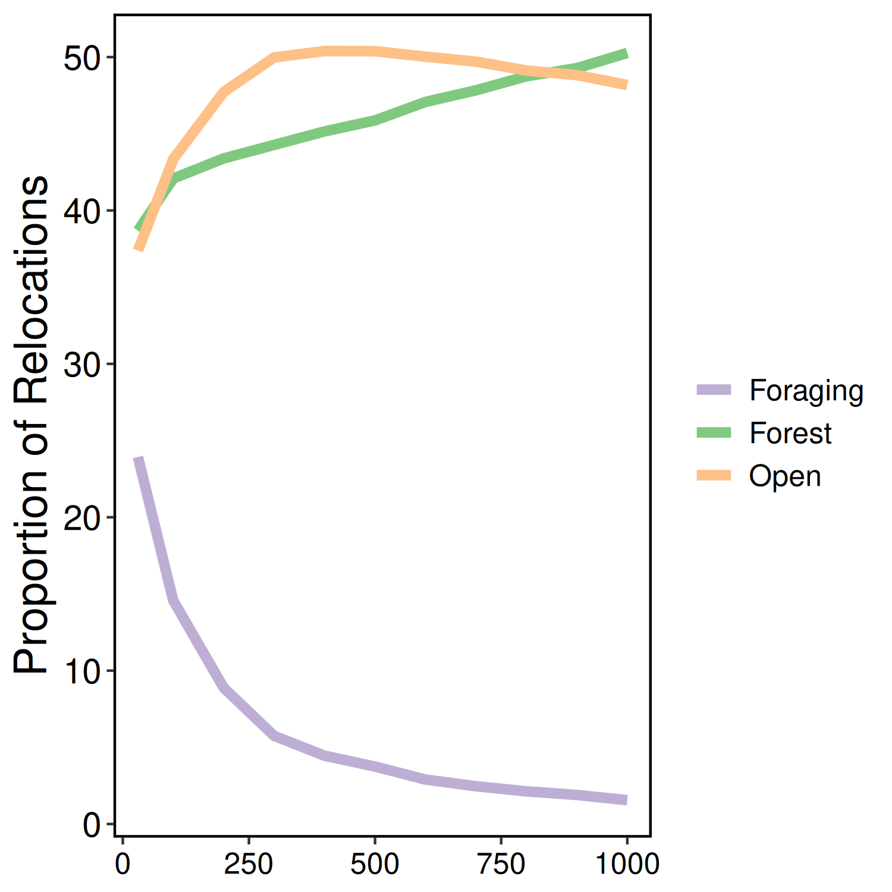

Supplement - Considering scale in multilayer animal social networks
================
Alec L. Robitaille1\*, Quinn M.R. Webber2, Julie
W. Turner1, Eric Vander Wal1,2
1Department of Biology, Memorial University of Newfoundland,
Canada  
2Cognitive and Behavioural Ecology Interdisciplinary Program,
Memorial University of Newfoundland  
\*Corresponding author: Alec L. Robitaille (<robit.alec@gmail.com>)

Table S1: Time cut definitions

| timecut | mindate    | maxdate    |
| ------: | :--------- | :--------- |
|       1 | 2017-04-21 | 2017-05-26 |
|       2 | 2017-05-27 | 2017-06-30 |
|       3 | 2017-07-01 | 2017-08-04 |
|       4 | 2017-08-05 | 2017-09-09 |
|       5 | 2017-09-10 | 2017-10-14 |
|       6 | 2017-10-15 | 2017-11-18 |
|       7 | 2017-11-19 | 2017-12-23 |
|       8 | 2017-12-24 | 2018-01-28 |
|       9 | 2018-01-29 | 2018-03-04 |
|      10 | 2018-03-05 | 2018-04-08 |
|      11 | 2018-04-09 | 2018-05-13 |
|      12 | 2018-05-14 | 2018-06-18 |
|      13 | 2018-06-19 | 2018-07-23 |
|      14 | 2018-07-24 | 2018-08-27 |
|      15 | 2018-08-28 | 2018-10-01 |
|      16 | 2018-10-02 | 2018-11-06 |
|      17 | 2018-11-07 | 2018-12-11 |
|      18 | 2018-12-12 | 2019-01-15 |
|      19 | 2019-01-16 | 2019-02-19 |
|      20 | 2019-02-20 | 2019-03-27 |

Figure S1: lc count by res

Figure S2: n individuals by time

