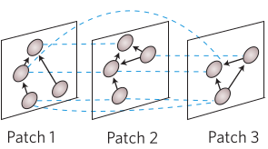
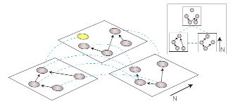

Alec Robitaille, Quinn M.R. Webber, Julie Turner and Eric Vander Wal
– 2019-09-26

### Table 1

In Table 1, we define three types of multilayer networks that
incorporate spatial variables. Multilayer networks are composed of
layers, nodes, interlayer edges and intralayer edges. Layers represent
the different types of relationships, individuals or contexts of the
social system. Nodes represent individual entities in the network,
connected by some association or relationship with edges. Interlayer
edges connect layers to other layers or individuals across layers.
Intralayer edges connect individuals to other individuals within a
network layer.

Depending on the type of network, interlayer edges connect individuals
to themselves across different contexts or to different individuals

multilayer networks with layers defined by spatially explicit locations,
interspecific interactions, and community or subpopulation structure.
Other types of networks, such as intercontexual networks or temporal
networks, are likely only to incorporate spatial variables in a hybrid
multilayer network and considerations for including those variables will
be explored here

An animal’s social network is multifaceted and complex, though this
system is often examined

How are layers defined, nodes defined, inter layer edges

We list variables affected by spatial and social scale

We use a definition of spatial scale from LE,

social scale is

TODO: find pictures of ML nets to include

|                  | Spatial network                                                     | Network of networks                                       | Interspecific network                           |
| :--------------- | :------------------------------------------------------------------ | :-------------------------------------------------------- | :---------------------------------------------- |
| Layer            | Spatially explicit patches, areas, landcovers                       | Subpopulations, fuzzy patches                             | Different species                               |
| Entities         | Individuals                                                         | Individuals                                               | Individuals                                     |
| Nodes            | Individual                                                          | Individuals and sub-networks                              | Individuals and species-specific networks       |
| Interlayer edges | Connect individuals to themselves                                   | Connect networks to networks                              | Connect species to species                      |
| Intralayer edges | Association to other individuals within network                     | Association to other individuals within network           | Association to other individuals within network |
| Social grain     | types of interaction, chain rule, spatsoc threshold, hyena sessions | For intra: see left. For inter: similarity, vulnerability |                                                 |
| Spatial grain    | resolution                                                          |                                                           | connectivity, clusters                          |
| Image md         |                                         |                             |               |
