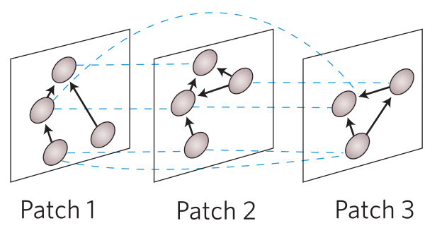
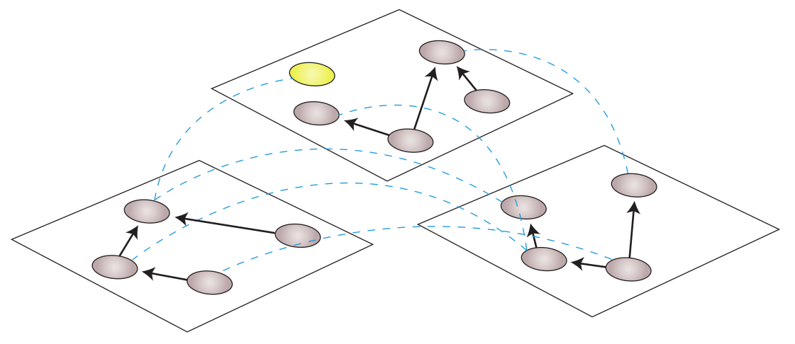
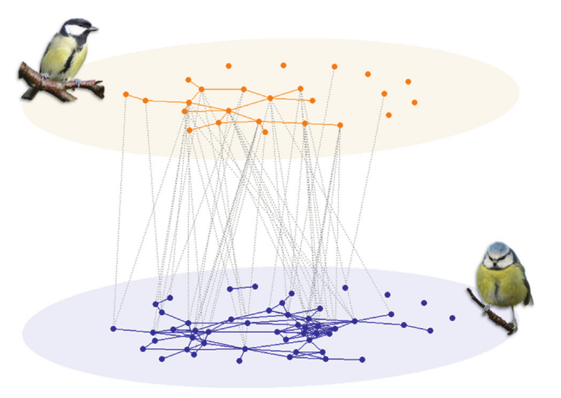

Alec Robitaille, Quinn M.R. Webber, Julie Turner and Eric Vander Wal
2019-09-27

<!--
*network of networks is just an intraspecific network* *interspecific networks are networks of networks*
-->

### Table 1

Multilayer networks are composed of layers, nodes and edges. Layers
represent different types of relationships (e.g.: grooming or
association), types of entities (e.g.: male and female, or different
species), and spatial locations (e.g.: landcover type, patch) \[1\].
Nodes represent individual entities in the network, connected by some
association or relationship with edges. Interlayer edges connect layers
to other layers or individuals across layers. Intralayer edges connect
individuals to other individuals within a layer. In Table 1, we describe
three types of multilayer networks that incorporate spatial variables:
spatially explicit networks, networks of networks and interspecific
networks. Other types of networks, such as intercontexual networks or
temporal networks, are likely only to incorporate spatial variables in a
hybrid multilayer network and relevant considerations will be detailed
here.

<!-- 
Relationships between individuals can be differentiated by their physical distance: communication or other high distance, grooming (physical contact), association (threshold distance)

An animal's social network is multifaceted and complex, though this system is often examined 

The edges are often abstracted because they no longer in the sense that they represent a specific spatial and temporal context, which

what about intralayer social grain -->

| Type of network  | Spatial network                                                                                                                                                             | Network of networks                                                                                                                                                         | Interspecific network                                                                                                                                                       |
| :--------------- | :-------------------------------------------------------------------------------------------------------------------------------------------------------------------------- | :-------------------------------------------------------------------------------------------------------------------------------------------------------------------------- | :-------------------------------------------------------------------------------------------------------------------------------------------------------------------------- |
| Layer            | Defined by spatially explicit areas (e.g. discrete patches, landcover classes)                                                                                              | Defined by sub-networks (e.g.: subpopulations, communities, fuzzy patches)                                                                                                  | Defined by different species                                                                                                                                                |
| Nodes            | • Individuals   • Spatially explicit layers                                                                                                                             | • Individuals   • Sub-network layers                                                                                                                                    | • Individuals   • Species-specific layers                                                                                                                               |
| Interlayer edges | • Connect individuals to themselves across layers   • Connect spatially explicit layers to each other (e.g.: defined by euclidean distance)                             | • Connect different individuals across sub-networks   • Connect sub-networks to each other                                                                              | • Connect individuals across species layers   • Connect species layers to each other                                                                                    |
| Intralayer edges | • Connect individuals within spatially explicit layer                                                                                                                       | • Connect individuals within sub-network                                                                                                                                    | • Connect individuals within species layers                                                                                                                                 |
| Social grain     | • Type of interaction between individuals \[2,3\]  • Chain rule \[4\]  • Definition of social association \[5\]  • Temporal window of social interactions \[6\] | • Type of interaction between individuals \[2,3\]  • Chain rule \[4\]  • Definition of social association \[5\]  • Temporal window of social interactions \[6\] | • Type of interaction between individuals \[2,3\]  • Chain rule \[4\]  • Definition of social association \[5\]  • Temporal window of social interactions \[6\] |
| Spatial grain    | • Spatial resolution of landcover  • Spatiotemporal grouping threshold \[7\]                                                                                            | • Number of fuzzy patches  • Spatial definition of subpopulations and communities                                                                                       | • Spatial connectivity                                                                                                                                                      |
| Examples         | todo                                                                                                                                                                        | todo                                                                                                                                                                        | \[8–10\]                                                                                                                                                                    |
| Image            |                                                                                                                                                      |                                                                                                                                                |                                                                                                                                            |

# References

\[1\] Pilosof S, Porter MA, Pascual M, Kéfi S. The multilayer nature of
ecological networks. Nature Ecology & Evolution 2017;1.
doi:[10.1038/s41559-017-0101](https://doi.org/10.1038/s41559-017-0101).

\[2\] Dale MRT. Applying graph theory in ecological research. Cambridge
University Press; 2017.

\[3\] Finn KR, Silk MJ, Porter MA, Pinter-Wollman N. The use of
multilayer network analysis in animal behaviour. Animal Behaviour
2019;149:7–22.
doi:[10.1016/j.anbehav.2018.12.016](https://doi.org/10.1016/j.anbehav.2018.12.016).

\[4\] Croft DP, James R, Krause J. Exploring Animal Social Networks.
Princeton University Press; 2008.

\[5\] Farine DR. Proximity as a proxy for interactions: Issues of scale
in social network analysis. Animal Behaviour 2015;104:e1–5.
doi:[10.1016/j.anbehav.2014.11.019](https://doi.org/10.1016/j.anbehav.2014.11.019).

\[6\] Cantor M, Wedekin LL, Guimarães PR, Daura-Jorge FG, Rossi-Santos
MR, Simões-Lopes PC. Disentangling social networks from spatiotemporal
dynamics: The temporal structure of a dolphin society. Animal Behaviour
2012;84:641–51.
doi:[10.1016/j.anbehav.2012.06.019](https://doi.org/10.1016/j.anbehav.2012.06.019).

\[7\] Robitaille AL, Webber QMR, Vander Wal E. Conducting social network
analysis with animal telemetry data: Applications and methods using
spatsoc. Methods in Ecology and Evolution 2019;10:1203–11.
doi:[10.1111/2041-210X.13215](https://doi.org/10.1111/2041-210X.13215).

\[8\] Farine DR, Garroway CJ, Sheldon BC. Social network analysis of
mixed-species flocks: Exploring the structure and evolution of
interspecific social behaviour. Animal Behaviour 2012;84:1271–7.
doi:[10.1016/j.anbehav.2012.08.008](https://doi.org/10.1016/j.anbehav.2012.08.008).

\[9\] Kéfi S, Miele V, Wieters EA, Navarrete SA, Berlow EL. How
Structured Is the Entangled Bank? The Surprisingly Simple Organization
of Multiplex Ecological Networks Leads to Increased Persistence and
Resilience. PLOS Biology 2016;14:e1002527.
doi:[10.1371/journal.pbio.1002527](https://doi.org/10.1371/journal.pbio.1002527).

\[10\] Courbin N, Fortin D, Dussault C, Courtois R. Logging-induced
changes in habitat network connectivity shape behavioral interactions in
the wolfCaribouMoose system. Ecological Monographs 2014;84:265–85.
doi:[10.1890/12-2118.1](https://doi.org/10.1890/12-2118.1).

